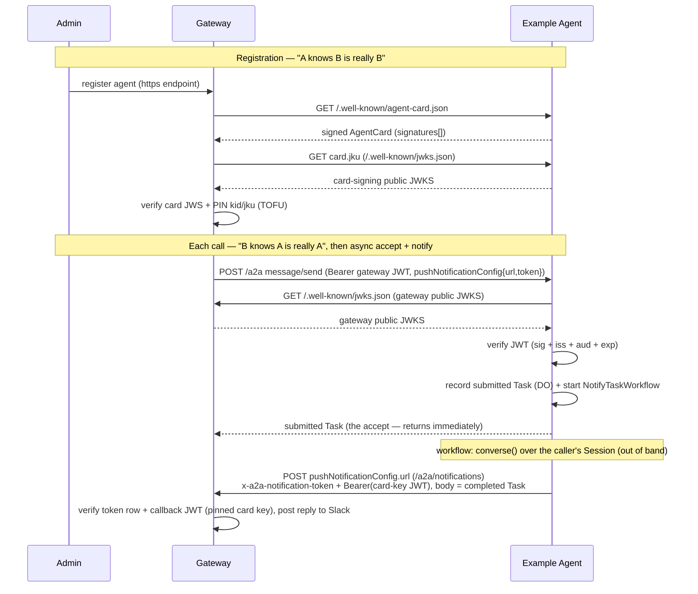

# Architecture

## The contract (both directions)

This agent therefore does three things:

1. **Serves a signed AgentCard** at `/.well-known/agent-card.json`. The card is
   signed with a detached-payload EdDSA flattened JWS over its **canonical JSON**
   (see [`src/a2a/canonical.ts`](src/a2a/canonical.ts)). The gateway verifies this and
   pins the signing key's `kid` + `jku` on first registration (Trust-On-First-Use).
2. **Publishes its card-signing public JWKS** at `/.well-known/jwks.json` (the
   card's `jku`), so the gateway can resolve the signing key.
3. **Verifies the gateway identity JWT** on every JSON-RPC call, resolving the
   gateway's public JWKS from the token's own `jku` header (RFC 7515 §4.1.2)
   and enforcing `iss`, `aud`, and `exp` against `GATEWAY_ORIGINS`.
   The verified caller identity is read from the namespaced
   `https://looping.ai/identity` claim and passed to the agent runtime.

> No secret is shared in either direction. The gateway proves it is the gateway
> with a signed JWT; this agent proves it is itself with a signed card. Each side
> only needs the other's **public** JWKS.

## Agent runtime (Durable Object + LLM tool loop)

Once the JWT is verified, [`src/index.ts`](src/index.ts) runs the A2A JSON-RPC
server for the call, and its [`A2AExecutor`](src/a2a/executor.ts) dispatches the
turn into the [`ProactiveAgent`](src/proactive-agent/index.ts) Durable Object with a
single native RPC call, passing the **verified** caller identity as a typed
argument — **one instance per calling gateway-agent**, keyed by the verified
`identity.key`. If the token carries no `key` the Worker refuses the call (400):
there is no shared/default instance to route to.

The DO is the agent runtime. It extends the Agents-SDK `Agent` (itself a genuine
`DurableObject` subclass), so the Worker reaches it with a single **native
Cloudflare RPC** call — `await stub.converse(text, identity)` — with no internal
HTTP or JSON-RPC layer: the DO is never exposed over the network, only reachable
from this Worker's own code. [`src/a2a/executor.ts`](src/a2a/executor.ts) is
the only A2A-protocol-aware piece on the Worker side: it records a `submitted`
Task in the caller's DO, starts the async delivery workflow, and publishes that
Task as the accept (see **Async task delivery** below). The DO backs a
**Session** with `this.sql`:

- **One continuous Session per caller** ([`src/agent/session.ts`](src/agent/session.ts)):
  a read-only `"soul"` identity block + a writable `"memory"` scratchpad the model
  self-edits (via the Session `set_context` tool), plus history. All of a caller's
  turns — across every channel/thread — accumulate into this single conversation.
  The agent is built to be a **long-lived, proactive** partner, not a stateless
  request/reply bot. Replies are already delivered asynchronously (see **Async
  task delivery** below); a future phase may go further and have the agent speak
  _first_ (proactive outreach) rather than only in response to a turn — `this.schedule`
  is the seam for that. It is already used for weekly data retention (see below).
- **Compaction** keeps the context lean: history is automatically compacted once
  it grows past `COMPACT_AFTER_TOKENS` (the Sessions `compactAfter` mechanism).
- **Episodic recall** ([`src/agent/recall.ts`](src/agent/recall.ts)): the raw
  messages each compaction displaces are embedded (Workers AI `@cf/baai/bge-m3`)
  and upserted into **Vectorize** via the Session's `onArchive` seam, namespaced
  per DO instance (the namespace is bound in code from the verified `identity.key`,
  never from model input). A `recall` tool then lets the model semantically search
  that archive for history that has scrolled out of the live context window. The
  tool is gated on "has compacted at least once", so it only appears once there is
  something to recall. Archival is best-effort — a Vectorize failure is swallowed so
  compaction still shortens history.
- **Model pair** ([`src/agent/model.ts`](src/agent/model.ts)): a primary + fallback
  Workers-AI model (via [`workers-ai-provider`](https://www.npmjs.com/package/workers-ai-provider)
  routed through an AI Gateway); also the compaction summarizer. Model ids, gateway
  slug, and Session tuning are constants in [`src/config.ts`](src/config.ts).
- **Turn loop** ([`src/agent/loop.ts`](src/agent/loop.ts)): `runTurn` appends the
  user turn to the Session, runs a bounded multi-step `generateText` loop
  (`stepCountIs(MAX_STEPS)`) over the Session history + soul + memory, persists the
  assistant reply, and returns the final reply text. Primary→fallback on error; a
  transient (capacity/timeout) or unexpected failure resolves to a friendly reply
  rather than throwing. [`ProactiveAgent.converse`](src/proactive-agent/index.ts) is the
  DO's one public RPC method — it wraps `runTurn` and returns its result.
- **Soul + caller context** ([`src/agent/prompt.ts`](src/agent/prompt.ts)): the frozen
  `"soul"` feeds the Session soul block; the verified caller is appended per turn as
  a system suffix. The prompt is aware of the gateway's `<turn>` provenance wrapper
  (parsed, never authored — see [`src/agent/history.ts`](src/agent/history.ts)).
- **Tools** ([`src/agent/tools.ts`](src/agent/tools.ts)): placeholder `whoami` /
  `echo` tools plus the `recall` episodic-memory search (merged over the Session's
  own `set_context`). `whoami` and `recall` close over the verified identity /
  instance namespace so neither can be spoofed from model input. Real domain tools
  (with per-call authorization) come in a later phase.

## Async task delivery (accept + notify)

The gateway dispatches remote agents **asynchronously** (A2A push notifications,
spec §13.2): it never blocks on generation. A `message/send` carries a
`configuration.pushNotificationConfig` (`{ url, token }` — the gateway's
`/a2a/notifications` webhook + a per-task validation token), the agent must
**accept immediately** with a `submitted`/`working` Task, and the reply is
delivered later by POSTing the terminal Task back to that webhook. A synchronous
`Message` reply from a remote agent is a protocol violation.

This agent implements that contract in three moving parts:

- **Accept (Worker).** [`src/index.ts`](src/index.ts) rejects a `message/send`
  without a `pushNotificationConfig` (JSON-RPC `-32602` — this agent is
  async-only), then the [`A2AExecutor`](src/a2a/executor.ts) records a `submitted`
  Task via the DO (`beginTask`, idempotent on the gateway's `messageId`), starts a
  [`NotifyTaskWorkflow`](src/workflows/notify-task.ts) whose instance id is derived
  from that `messageId`, and publishes the Task as the accept — all in well under
  the gateway's 30s accept timeout. Task state persists in the DO
  ([`src/a2a/task-store.ts`](src/a2a/task-store.ts) backs the a2a-js `TaskStore`),
  so `tasks/get` works across the accept→callback gap. Rows are retained for 30 days;
  `ProactiveAgent.cleanupOldTasks` runs as a weekly cron (Sunday 01:00 UTC) via the
  Agents SDK `this.schedule` API, registered idempotently in `onStart`.
- **Generate + deliver (Workflow).**
  [`src/workflows/notify-task.ts`](src/workflows/notify-task.ts) is the durable
  controller. Its `step.do(...)` steps run `converse()` on the caller's DO
  (native RPC — a Workflow can't touch the DO's SQLite directly, so turn inputs
  ride as the workflow payload and task state is mutated only through DO RPC),
  then POST the completed Task to the gateway webhook. Steps are durable and
  retried; a future human-approval interrupt slots in as a `step.waitForEvent`
  between generation and delivery. Idempotency comes from the deterministic
  instance id (a dispatch retry never starts a second run) plus the gateway's
  single-use callback token, giving exactly-once effect.
- **Callback auth (`src/a2a/notify.ts`).** The callback is authenticated exactly
  like the AgentCard: a short-lived EdDSA JWT signed by `A2A_SIGNING_KEY` whose
  protected-header `kid`+`jku` **equal the card's** (the gateway pinned those at
  registration), with `aud` = the webhook URL. The completed Task carries the
  reply in `status.message` (where the gateway's `extractText` reads it). Still
  zero shared secrets — the gateway verifies against this agent's public JWKS.

## Canonical JSON (must match the gateway)

The card signature is computed over a deterministic serialization:

- object keys sorted recursively (ascending),
- `JSON.stringify` with no insignificant whitespace,
- the `signatures` field excluded,
- payload bytes = UTF-8, base64url (no padding) for the JWS.

[`src/a2a/canonical.ts`](src/a2a/canonical.ts) is a byte-for-byte copy of the gateway's
[`src/a2a/card-verify.ts`](https://github.com/Looping-AI/looping-gateway/blob/main/src/a2a/card-verify.ts) canonicalizer. **If you change one, change both.**

## Environment

| Variable          | Where   | Purpose                                                                                              |
| ----------------- | ------- | ---------------------------------------------------------------------------------------------------- |
| `A2A_SIGNING_KEY` | secret  | Ed25519 private JWK (with `kid`) that signs the AgentCard.                                           |
| `GATEWAY_ORIGINS` | secret  | JSON array of trusted gateway origins, e.g. `["https://gw.example.com"]`. Validates `jku` and `iss`. |
| `AI`              | binding | Workers AI binding (routed via AI Gateway) backing the LLM tool loop + recall embeddings.            |
| `ProactiveAgent`  | binding | Durable Object namespace — one instance per caller, holding the durable Session + task state.        |
| `VECTORIZE`       | binding | Vectorize index (`proactive-agent-recall`, 1024-dim/cosine) storing per-instance episodic recall.    |
| `NOTIFY_WORKFLOW` | binding | Cloudflare Workflow (`NotifyTaskWorkflow`) that generates a turn and delivers the push callback.     |

> The recall index is created out of band before deploy (it must match the
> embedding model's output):
> `wrangler vectorize create proactive-agent-recall --dimensions=1024 --metric=cosine`.
> Vectorize has no local-development mode, so `npm run dev` prints a warning and
> the test suite injects a fake index rather than binding a real one.

## Files

| File                                                                 | Role                                                                                                               |
| -------------------------------------------------------------------- | ------------------------------------------------------------------------------------------------------------------ |
| [`src/index.ts`](src/index.ts)                                       | Worker entry: card / JWKS; verifies JWT, then runs the A2A JSON-RPC server dispatching into the caller's DO.       |
| [`src/a2a/card.ts`](src/a2a/card.ts)                                 | Build + sign the AgentCard; derive public JWKS; parse signing key.                                                 |
| [`src/a2a/canonical.ts`](src/a2a/canonical.ts)                       | Canonical JSON contract (mirrors the gateway).                                                                     |
| [`src/a2a/verify.ts`](src/a2a/verify.ts)                             | Verify the gateway identity JWT.                                                                                   |
| [`src/proactive-agent/index.ts`](src/proactive-agent/index.ts)       | `ProactiveAgent` DO — owns the caller's Session (`converse()`) + durable async task state (`beginTask`, …).        |
| [`src/a2a/task.ts`](src/a2a/task.ts)                                 | `PlainTask` — SDK `Task` minus `unknown` extension `metadata`, so DO-RPC `Task` returns don't collapse to `never`. |
| [`src/agent/session.ts`](src/agent/session.ts)                       | The continuous Session (soul + memory + compaction).                                                               |
| [`src/a2a/executor.ts`](src/a2a/executor.ts)                         | `A2AExecutor` — accepts a turn (submitted Task) and starts the notify workflow.                                    |
| [`src/a2a/task-store.ts`](src/a2a/task-store.ts)                     | `DurableTaskStore` — DO-backed a2a-js `TaskStore` (durable task state across accept→callback).                     |
| [`src/a2a/notify.ts`](src/a2a/notify.ts)                             | Build the submitted/completed Tasks; sign + POST the gateway push-notification callback.                           |
| [`src/workflows/notify-task.ts`](src/workflows/notify-task.ts)       | `NotifyTaskWorkflow` — durable controller: converse → complete → notify the gateway.                               |
| [`src/agent/loop.ts`](src/agent/loop.ts)                             | `runTurn` — Session turn runner (primary → fallback, transient handling).                                          |
| [`src/agent/model.ts`](src/agent/model.ts)                           | Workers-AI primary/fallback model pair (via AI Gateway).                                                           |
| [`src/agent/prompt.ts`](src/agent/prompt.ts)                         | Soul (identity + rules) + per-request caller context.                                                              |
| [`src/agent/tools.ts`](src/agent/tools.ts)                           | `whoami` / `echo` placeholders + the gated `recall` tool (pure handlers + AI-SDK wiring).                          |
| [`src/agent/recall.ts`](src/agent/recall.ts)                         | Episodic recall: embed + upsert compacted-away messages to Vectorize; semantic search.                             |
| [`src/a2a/inbound.ts`](src/a2a/inbound.ts)                           | Inbound A2A message → text (`textOf`) — the one place touching the `@a2a-js/sdk` message shape.                    |
| [`src/agent/history.ts`](src/agent/history.ts)                       | `<turn>` provenance parsing + Session-history message glue (no A2A types).                                         |
| [`src/config.ts`](src/config.ts)                                     | Model ids, AI Gateway slug, loop bound, Session/compaction tuning.                                                 |
| [`src/proactive-agent/manifest.ts`](src/proactive-agent/manifest.ts) | AgentCard identity + advertised skills.                                                                            |
| [`scripts/generate-keys.mjs`](scripts/generate-keys.mjs)             | Ed25519 JWK keypair generator.                                                                                     |
