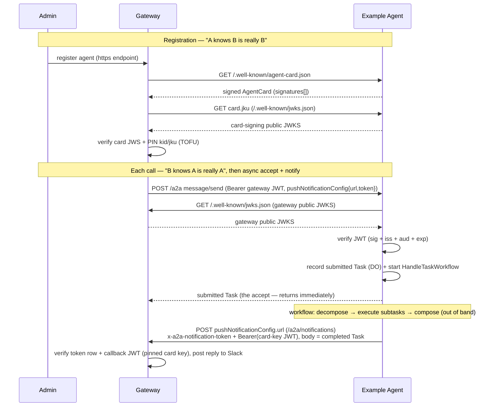
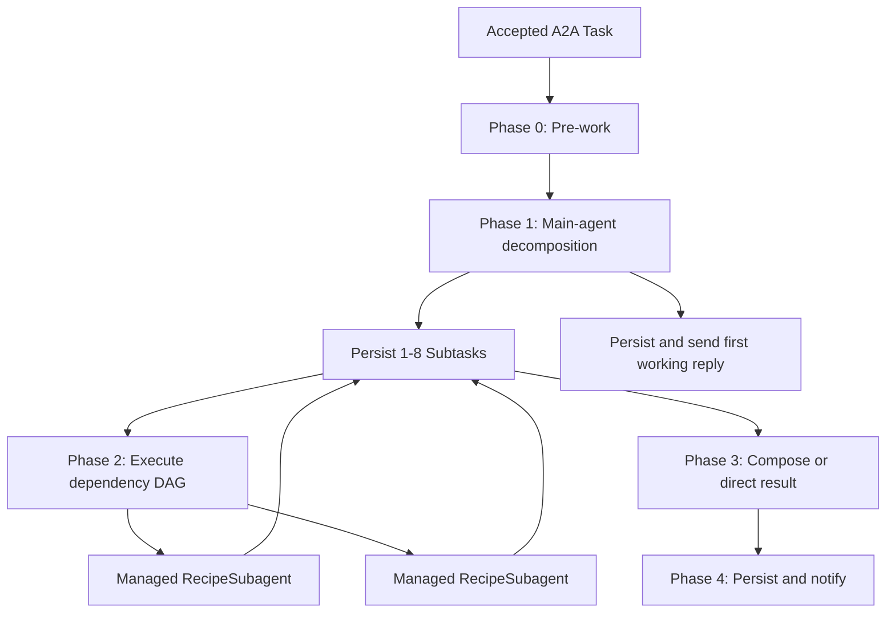

# Architecture

## The contract (both directions)

This agent therefore does three things:

1. **Serves a signed AgentCard** at `/.well-known/agent-card.json`. The card is
   signed with a detached-payload EdDSA flattened JWS over its **canonical JSON**
   (see [`src/a2a/canonical.ts`](src/a2a/canonical.ts)). The gateway verifies this and
   pins the signing key's `kid` + `jku` on first registration (Trust-On-First-Use).
2. **Publishes its card-signing public JWKS** at `/.well-known/jwks.json` (the
   card's `jku`), so the gateway can resolve the signing key.
3. **Verifies the gateway identity JWT** on every JSON-RPC call, resolving the
   gateway's public JWKS from the token's own `jku` header (RFC 7515 §4.1.2)
   and enforcing `iss`, `aud`, and `exp` against `GATEWAY_ORIGINS`.
   The verified caller identity is read from the namespaced
   `https://looping.ai/identity` claim and passed to the agent runtime.

> No secret is shared in either direction. The gateway proves it is the gateway
> with a signed JWT; this agent proves it is itself with a signed card. Each side
> only needs the other's **public** JWKS.

## Agent runtime (Durable Object + continuous Session)

Once the JWT is verified, [`src/index.ts`](src/index.ts) runs the A2A JSON-RPC
server for the call, and its [`A2AExecutor`](src/a2a/executor.ts) accepts the
turn into the [`ReactiveAgent`](src/reactive-agent/index.ts) Durable Object,
passing the **verified** caller identity as a typed argument — **one instance per
calling gateway-agent**, keyed by the verified `identity.key`. If the token
carries no `key` the Worker refuses the call (400): there is no shared/default
instance to route to.

The DO is the agent runtime. It extends the Agents-SDK `Agent` (itself a genuine
`DurableObject` subclass), so the Worker and the Workflow reach it over **native
Cloudflare RPC** with no internal HTTP or JSON-RPC layer: the DO is never exposed
over the network, only reachable from this Worker's own code. Its RPC surface is
a set of narrow, phase-shaped methods — `decomposeTask`, `executeSubtaskChunk`,
`listSubtasks`, `skipBlockedSubtasks`, `failSubtask`, `cancelPendingSubtasks`,
`composeTask` for the pipeline, and `beginTask` / `getTask` / `saveTask` /
`markWorking` / `cancelTask` / `cleanupOldTasks` for Task state. Several of them
answer "was this canceled?" in their own return rather than making the caller ask
first — see **Failure and cancellation**. There is no
general "run a turn" entry point: inference happens only inside the pipeline
phases below. [`src/a2a/executor.ts`](src/a2a/executor.ts) is the only
A2A-protocol-aware piece on the Worker side: it records a `submitted` Task in the
caller's DO, starts the async delivery workflow, and publishes that Task as the
accept (see **Async task delivery** below). The DO backs a **Session** with
`this.sql`:

- **One continuous Session per caller** ([`src/agent/session.ts`](src/agent/session.ts)):
  a read-only `"soul"` identity block + a writable `"memory"` scratchpad the model
  self-edits (via the Session `set_context` tool), plus history. All of a caller's
  turns — across every channel/thread — accumulate into this single conversation.
  The agent is a **long-lived, reactive** partner: it responds to gateway turns
  instead of initiating outreach. Replies are delivered asynchronously (see **Async
  task delivery** below), and `this.schedule` is used for weekly data retention
  (see below).
- **Compaction** keeps the context lean: history is automatically compacted once
  it grows past `COMPACT_AFTER_TOKENS` (the Sessions `compactAfter` mechanism).
- **Episodic recall** ([`src/agent/recall.ts`](src/agent/recall.ts)): the raw
  messages each compaction displaces are embedded (Workers AI `@cf/baai/bge-m3`)
  and upserted into **Vectorize** via the Session's `onArchive` seam, namespaced
  per DO instance (the namespace is bound in code from the verified `identity.key`,
  never from model input). A `recall` tool then lets the model semantically search
  that archive for history that has scrolled out of the live context window. The
  tool is gated on "has compacted at least once", so it only appears once there is
  something to recall. Archival is best-effort — a Vectorize failure is swallowed so
  compaction still shortens history.
- **Model pair** ([`src/agent/model.ts`](src/agent/model.ts)): a primary + fallback
  Workers-AI model (via [`workers-ai-provider`](https://www.npmjs.com/package/workers-ai-provider)
  routed through an AI Gateway); also the compaction summarizer. Model ids, gateway
  slug, and Session tuning are constants in [`src/config.ts`](src/config.ts).
- **Main-agent operations** ([`src/agent/decompose.ts`](src/agent/decompose.ts),
  [`src/agent/compose.ts`](src/agent/compose.ts)): the two places the main agent
  infers over the Session — Phase 1 splits the task into Subtasks, Phase 3 writes
  the final reply. Shared model plumbing (transient-error classification,
  intermediate-content streaming) lives in
  [`src/agent/inference.ts`](src/agent/inference.ts). Both do their own
  primary→fallback recovery; neither is a general turn runner.
- **Soul + caller context** ([`src/agent/prompt.ts`](src/agent/prompt.ts)): the frozen
  `"soul"` feeds the Session soul block; the verified caller is appended per turn as
  a system suffix. The prompt is aware of the gateway's `<turn>` provenance wrapper
  (parsed, never authored — see [`src/agent/history.ts`](src/agent/history.ts)).
- **Tools** ([`src/agent/tools.ts`](src/agent/tools.ts)): the main agent gets
  placeholder `whoami` / `echo` tools plus the `recall` episodic-memory search
  (merged over the Session's own `set_context`). `whoami` and `recall` close over
  the verified identity / instance namespace so neither can be spoofed from model
  input. Subagents get a disjoint set built by `buildRecipeTools` from their
  Recipe's tool families — today `browser` (Browser Rendering Quick Actions).
  Per-call **authorization** policy for domain tools is still a later phase.

## The task pipeline (five phases)

Every accepted Task runs through five phases in
[`src/workflows/handle-task.ts`](src/workflows/handle-task.ts). The main agent
never answers a task directly: it **decomposes** it into one to eight durable
Subtasks, runs the dependency-ready ones concurrently in isolated subagents, and
**composes** their outcomes into the reply.

The durable step sequence is `working` → `decompose` → one wave per iteration
(`scan:<n>`, then per-branch a loop of `execute:<id>` (chunk 0) and
`execute:<id>:chunk:<n>` (n≥1) until done, then `fail:<id>` on failure, or
`cancel:<n>` if the Task was canceled) → `compose` → `complete` → `notify`.
**Those names are durable cache keys** — renaming one silently re-runs its effect
on replay, so treat them as a contract, not labels.

> **The Subtask rows are the source of truth; Workflow state is not.** A `step.do`
> return is capped at **1 MiB**, and a Subtask carries verbatim reference
> snapshots bounded only by `MAX_INBOUND_TEXT_BYTES` (256 KB) — so steps return
> narrow projections (`SubtaskNode`: `{id, ordinal, status, dependsOn}`), never
> rows. Every phase recovers by re-reading the database and the Session, which is
> also why replay is safe.

- **Phase 1 — decompose** ([`src/agent/decompose.ts`](src/agent/decompose.ts)).
  One `generateText` call in which the model calls
  [`delegate`](src/agent/subtasks/delegate.ts), whose input schema _is_ the
  decomposition contract: a first user-visible `reply` plus one to eight Subtask
  drafts. The tool has no `execute` — the Workflow performs the call, durably, and
  Phase 3 reassembles it with its result — so the call is the phase's output and
  the loop halts on it. The model may use its own tools first; the last permitted
  step forces the pick so a loop cannot end undecided. Failure on **both** models
  fails the Task; a general Subtask is never synthesized, because that would
  deliver plausible work nobody asked for.
- **Phase 2 — execute** ([`src/agent/subtasks/scheduler.ts`](src/agent/subtasks/scheduler.ts)).
  `selectWave` picks every node whose dependencies completed; all of them run
  concurrently (the eight-Subtask maximum is the only fan-out bound). The
  scheduler **does not re-validate the DAG**: `createDecomposition` already
  rejected missing, self-referential, and cyclic edges before a row existed, and
  all three manifest identically as _no progress possible_ — which the single
  "active nodes but none ready" check already catches.
- **Phase 3 — compose** ([`src/agent/compose.ts`](src/agent/compose.ts)).
  The model sees the outcomes as the **result of the `delegate` call it made in
  Phase 1**: `renderCompositionMessages` re-attaches the call to the stored reply
  and appends its result, rebuilding both halves from the durable rows. Nothing is
  fabricated — only a Workflow boundary separated them. "Tool result → assistant
  writes the user's reply" is a pattern every instruction-tuned model knows, so it
  carries both facts this phase needs (the outcomes are generated output, not
  conversation evidence; it is now the model's turn) without a prompt asserting
  either. `delegate` is declared here but pinned with `toolChoice: "none"`: the
  history's call needs its definition, and the work is already done.
  Composition is **bypassed only when decomposition produced exactly one Subtask
  total** and it succeeded. Any multi-Subtask task with at least one success
  composes — bypassing a 1-success/2-failure DAG would return the success's raw
  text and silently hide the failures.

### Subtask contract and lifecycle

A Subtask is a durable row with three **distinct** input categories, kept
distinguishable all the way into the subagent's prompt:

| Input               | Origin                      | Rule                                                                               |
| ------------------- | --------------------------- | ---------------------------------------------------------------------------------- |
| `prompt`            | generated by the main agent | The only channel for summaries, recall, or tool output — at main-agent discretion. |
| `references`        | verbatim Session history    | Copied exactly; the model never rewrites, summarizes, or relabels them.            |
| `dependencyResults` | prerequisite Subtask output | Rendered explicitly as **generated output**, never as conversation evidence.       |

Status flows `pending` → `running` → one of `completed` · `failed` · `skipped` ·
`canceled`. Transitions are guarded (`UPDATE … WHERE status = <expected>` +
`.returning()`), so a disallowed transition is a no-op rather than a corruption.

**References are resolved once, at decomposition.** At Phase 1 the eligible live
history turns are numbered `1..N` into an ephemeral catalog
([`src/agent/subtasks/catalog.ts`](src/agent/subtasks/catalog.ts)); the model
selects **indices only**, and application code copies each selected message's
exact role+text onto the row. Execution never re-reads the Session, so mid-task
compaction cannot affect a Subtask already in flight, and no rewritten "quote" can
reach a subagent. Compaction summaries are excluded from the catalog (the SDK's
`compaction_` message-id prefix) — readable as context, structurally uncitable as
evidence.

### Recipes

A Recipe configures one isolated subagent invocation: enabled state, version,
primary/fallback model ids, soul text, and tool families. The `default` Recipe is
a **code constant** (`DEFAULT_RECIPE` in
[`src/agent/subtasks/registry.ts`](src/agent/subtasks/registry.ts), sourcing model ids
from [`src/config.ts`](src/config.ts)) — not a database row, so it cannot go stale
against the configured models and needs no migration seed.

Decomposition assigns only a semantic Subtask `type`; it never names a Recipe.
`resolveRecipeForType` maps type → Recipe (always `default` today) and is the seam
a future Recipe admin surface extends. `validateRecipe` is the capability
boundary: the model allowlist is exactly the two config ids (a non-allowlisted id
is substituted with its slot's config default, independently per slot), unknown
tool families are dropped, a blank soul falls back to `STATELESS_SUBAGENT_SOUL`,
and a disabled Recipe throws. `recall` and the Session `set_context` tool are
**structurally impossible** for a subagent — they are never in the family map.
Recipe data never supplies arbitrary bindings, tools, or secrets. The resolved
Recipe id and version are recorded on the row after the fact, at execution start.

### Subagent lifecycle and retry safety

Each Subtask executes in a `RecipeSubagent` ([`src/subagent/`](src/subagent/)) —
an Agents-SDK **facet** created beneath the caller's `ReactiveAgent`, so it needs
no wrangler binding (it must only stay exported from `src/index.ts` so
`ctx.exports` can resolve it by class name). It has no Session, no durable memory,
no recall, and no access to parent history beyond the supplied references.

**One resumable runner, driven in durable chunks.** Every recipe — from a
single-shot default Subtask to a thousand-turn game — runs the same agentic loop
(`runResumableChunk`, [`src/subagent/run.ts`](src/subagent/run.ts)), customized
only by the recipe's `limits` (`maxTurns`/`turnsPerChunk`/`chunkSoftMs`) and
`historyWindow`. `executeChunk(request, chunk)` advances one chunk: up to
`turnsPerChunk` model turns (or `chunkSoftMs`, or until a tool emits progress),
checkpointing rolling state to a `run_state` row after every turn, then returning
either a terminal result or a `done: false` yield. The Workflow runs each chunk as
its own retryable `step.do` (`execute:<id>`, then `execute:<id>:chunk:<n>`) and
loops until done — so no step approaches the platform step timeout, and a crash
loses at most the in-flight turn. The default recipe sets
`maxTurns === turnsPerChunk`, so it finishes on chunk 0, byte-identical to the
pre-resumable pipeline. Domain behavior lives entirely in **tool families**; a
long recipe keeps only a small rolling context window and persists durable state
(hypotheses, plans, external-session ids) to its **workspace** — a file store
([`src/subagent/workspace.ts`](src/subagent/workspace.ts)) backed by
`@cloudflare/shell`'s `Workspace` over the facet's own SQLite, wiped with the
child on `deleteSubAgent`.

Retry safety rests on two mechanisms:

- **The child caches exactly one terminal result**, keyed by a SHA-256 fingerprint
  of the request ([`src/subagent/fingerprint.ts`](src/subagent/fingerprint.ts)).
  Terminal outcomes — completed **and** failed — replay with zero inference. A
  transient platform fault throws and caches **nothing**, so a Workflow retry
  re-runs inference by design. A _different_ request arriving at a child that
  already holds a result throws `FINGERPRINT_MISMATCH` (a message prefix, because
  error classes don't survive DO RPC), signalling a parent lifecycle bug.
- **Winning the `pending → running` claim is what distinguishes a fresh execution
  from a retry** — and that decides whether the child may be deleted. Claiming the
  row means fresh, so any stale child is deleted first. _Losing_ the claim with the
  row still `running` means a previous attempt crashed mid-execution, so the child
  is **not** deleted: its cache may hold the terminal result that makes the retry
  free. The child is deleted only **after** its result is durably copied into the
  parent — never before.

### Failure and cancellation

- A failed branch **skips its dependent descendants** (propagated to a fixpoint,
  bounded by the eight-Subtask maximum) while independent branches keep running.
- A branch that exhausts its step retries fails **the branch, not the Task**
  (`fail:<id>`), so composition can disclose the gap while its siblings keep the
  durable work they finished.
- If both models fail composition _deterministically_, `runCompose` joins the
  successful branches' text in ordinal order plus a fixed disclosure note and the
  Task completes. **Degrade rather than discard**: failing a Task whose branch work
  is already durable would throw away results the user asked for. Transient faults
  still throw for the step to retry.
- **Cancellation is a phase return, not a probe.** `tasks/cancel` converges on the
  DO's `markCanceled` from both entry points (the executor, and — the path that
  actually runs — the a2a-js handler's own cancel branch through `saveTask`).
  Every phase RPC then reports the verdict itself: `markWorking` returns
  `"canceled"`, `skipBlockedSubtasks` returns `{canceled}` alongside the wave, and
  `decomposeTask`/`composeTask` gained a `canceled` status. The Workflow reads
  those instead of issuing a separate `getTask` before each step, so a phase
  cannot act on a stale answer.
- A canceled row is **terminal**: `tasks.save` refuses every non-canceled write
  over it and returns whether it applied. Terminal delivery is keyed on that
  return, which is what actually prevents a `completed` callback racing a cancel —
  a check-then-save would leave a window both inside the `complete` step and
  between it and `notify`.
- Decomposition and composition re-read cancellation **after** their model call as
  well: no Subtask rows are persisted and no `working` callback is published for a
  Task the caller gave up on. Their reply may already be in the Session by then —
  durable history under a deterministic id, never published output.
- A canceled Task **interrupts work already in flight**. `markCanceled` calls
  `RecipeSubagent.abortRun` on every `running` Subtask's child, which aborts the
  `AbortSignal` passed to that chunk's `generateText`. An aborted run _yields_ — it
  never produces a terminal result — so nothing lands in the fingerprint cache and
  no fabricated failure can replay on a retry; the parent resolves the row with
  `cancelRunning` plus the tool families' `abort` hooks. Without this a long recipe
  would keep playing until its next chunk boundary (`chunkSoftMs`, minutes).
- A branch failed by the Workflow (`fail:<id>`) also runs its child's `abort` hooks
  before the sweep, so an abandoned run does not leak external state.
- Internal diagnostics stay on the row and in logs — the composition model is told
  _that_ a branch failed, not its stack trace, so it discloses the gap in user-safe
  words.

## Async task delivery (accept + notify)

The gateway dispatches remote agents **asynchronously** (A2A push notifications,
spec §13.2): it never blocks on generation. A `message/send` carries a
`configuration.pushNotificationConfig` (`{ url, token }` — the gateway's
`/a2a/notifications` webhook + a per-task validation token), the agent must
**accept immediately** with a `submitted`/`working` Task, and the reply is
delivered later by POSTing the terminal Task back to that webhook. A synchronous
`Message` reply from a remote agent is a protocol violation.

This agent implements that contract in three moving parts:

- **Accept (Worker).** [`src/index.ts`](src/index.ts) rejects a `message/send`
  without a `pushNotificationConfig` (JSON-RPC `-32602` — this agent is
  async-only), then the [`A2AExecutor`](src/a2a/executor.ts) records a `submitted`
  Task via the DO (`beginTask`, idempotent on the gateway's `messageId`), starts a
  [`HandleTaskWorkflow`](src/workflows/handle-task.ts) whose instance id is derived
  from that `messageId`, and publishes the Task as the accept — all in well under
  the gateway's 30s accept timeout. Task state persists in the DO
  ([`src/a2a/task-store.ts`](src/a2a/task-store.ts) backs the a2a-js `TaskStore`),
  so `tasks/get` works across the accept→callback gap. Rows are retained for 30 days;
  `ReactiveAgent.cleanupOldTasks` runs as a weekly cron (Sunday 01:00 UTC) via the
  Agents SDK `this.schedule` API, registered idempotently in `onStart`.
- **Generate + deliver (Workflow).**
  [`src/workflows/handle-task.ts`](src/workflows/handle-task.ts) is the durable
  controller running the five phases above. Every step reaches the caller's DO by
  native RPC — a Workflow can't touch the DO's SQLite directly, so turn inputs
  ride as the workflow payload and task state is mutated only through DO RPC —
  and the last step POSTs the terminal Task to the gateway webhook. Steps are
  durable and retried; a future human-approval interrupt slots in as a
  `step.waitForEvent` between composition and delivery. Idempotency is layered:
  the deterministic instance id (a dispatch retry never starts a second run), the
  gateway's single-use callback token, and — because steps replay — **per-phase
  recovery from durable state**: `Session.appendMessage` dedupes by message id, so
  deterministic ids (`task:<id>:user`, `…:reply:decompose`, `…:reply:final`) make
  each phase's append exactly-once; a re-run of `decompose` recovers its rows and
  reply with zero inference; a chunk sequence (`execute:<id>` / `…:chunk:<n>`)
  recovers from the parent row or the child's fingerprint cache and run-state
  checkpoint.
- **Callback auth (`src/a2a/notify.ts`).** The callback is authenticated exactly
  like the AgentCard: a short-lived EdDSA JWT signed by `A2A_SIGNING_KEY` whose
  protected-header `kid`+`jku` **equal the card's** (the gateway pinned those at
  registration), with `aud` = the webhook URL. The terminal Task carries the reply
  in `status.message` (where the gateway's `extractText` reads it) — `completed`
  with the composed reply, or `failed` with **user-safe** text (the diagnostic
  stays on the Subtask row and in logs, never in the callback body). Progress
  replies are posted as `working` Tasks under stable semantic keys — `step:<n>`
  for tool-loop progress, `decompose` for the Phase 1 reply, `final` for the
  terminal one — three namespaces that cannot collide. Still zero shared secrets:
  the gateway verifies against this agent's public JWKS.

## Durable state (SQLite + migrations)

Every DO instance owns a private SQLite database
([`src/db/schema.ts`](src/db/schema.ts)), reached through `AgentDB`
([`src/db/db.ts`](src/db/db.ts)) — one drizzle handle plus memoized per-table
namespaces (`db.tasks`, `db.subtasks`). Two tables:

| Table          | Role                                                                    |
| -------------- | ----------------------------------------------------------------------- |
| `notify_tasks` | A2A Task state across the accept→callback gap; answers `tasks/get`.     |
| `subtasks`     | The decomposition: one row per Subtask, the pipeline's source of truth. |

`subtasks` uses an SQLite `AUTOINCREMENT` integer primary key, so a `SubtaskId` is
caller-local, monotonic, and never reused after cleanup. It stores the parent task
id and `ordinal`, semantic type, nullable resolved Recipe id/version, the prompt,
`references_json` (verbatim role+text snapshots), `depends_on_json` (resolved
`SubtaskId`s), status, `result_parts_json`, an optional diagnostic error, and
timestamps. Both its indexes — `idx_subtasks_task_ordinal` (**unique**: the
schema-level backstop for idempotent creation) and `idx_subtasks_status` — are
declared **inline in the `sqliteTable` callback**; a standalone `index()` export
makes the pinned drizzle-kit emit a phantom `DROP INDEX`.

Creating a decomposition is atomic and idempotent on the parent task id, wrapped in
an explicit synchronous `db.transaction`. DO write coalescing makes the durable
commit atomic but does **not** undo already-executed statements, which would
otherwise strand a truncated, edge-less DAG behind the idempotency guard.

Migrations follow the Agents SDK pattern: there is no global apply step, because
each instance has its own database — `AgentDB`'s constructor runs `migrate()`
(idempotent; Drizzle tracks applied migrations in `__drizzle_migrations`) and
`onStart()` forces that on every wake-up. Workers have no runtime filesystem, so
the generated SQL is bundled inline in
[`src/db/migrations/index.ts`](src/db/migrations/index.ts). Expired Tasks and their
Subtasks are cleaned up together after 30 days (both keyed on their own
`created_at`, written in the same Task lifecycle).

## Canonical JSON (must match the gateway)

The card signature is computed over a deterministic serialization:

- object keys sorted recursively (ascending),
- `JSON.stringify` with no insignificant whitespace,
- the `signatures` field excluded,
- payload bytes = UTF-8, base64url (no padding) for the JWS.

[`src/a2a/canonical.ts`](src/a2a/canonical.ts) is a byte-for-byte copy of the gateway's
[`src/a2a/card-verify.ts`](https://github.com/Looping-AI/looping-gateway/blob/main/src/a2a/card-verify.ts) canonicalizer. **If you change one, change both.**

## Environment

| Variable               | Where   | Purpose                                                                                                                                                                                                 |
| ---------------------- | ------- | ------------------------------------------------------------------------------------------------------------------------------------------------------------------------------------------------------- |
| `A2A_SIGNING_KEY`      | secret  | Ed25519 private JWK (with `kid`) that signs the AgentCard.                                                                                                                                              |
| `GATEWAY_ORIGINS`      | secret  | JSON array of trusted gateway origins, e.g. `["https://gw.example.com"]`. Validates `jku` and `iss`.                                                                                                    |
| `AI`                   | binding | Workers AI binding (routed via AI Gateway) backing decomposition, subagent execution, composition, and recall embeddings.                                                                               |
| `BROWSER`              | binding | Browser Rendering, backing the `browser` Recipe tool family (Quick Actions) subagents run with. **Requires a paid Workers plan — not on the free tier.**                                                |
| `ReactiveAgent`        | binding | Durable Object namespace — one instance per caller, holding the durable Session, Subtask rows, and task state. Managed `RecipeSubagent` facets are created beneath it and need no binding of their own. |
| `VECTORIZE`            | binding | Vectorize index (`reactive-agent-recall`, 1024-dim/cosine) storing per-instance episodic recall.                                                                                                        |
| `HANDLE_TASK_WORKFLOW` | binding | Cloudflare Workflow (`HandleTaskWorkflow`) that runs the five-phase pipeline and delivers the push callback.                                                                                            |

> The recall index is created out of band before deploy (it must match the
> embedding model's output):
> `wrangler vectorize create reactive-agent-recall --dimensions=1024 --metric=cosine`.
> Vectorize has no local-development mode, so `npm run dev` prints a warning and
> the test suite injects a fake index rather than binding a real one.

## Known risks (unverified against real infrastructure)

The test suite is deliberately **hermetic** — no network, no real inference — so
a few things are proven only by construction and stay unverified until production
traffic. They are characteristics, not known bugs; none is a correctness hole.

1. **The delegation tool call, on both ends.** Phase 1 needs the real models to
   call `delegate` and fill its schema; Phase 3 hands them a history containing
   that call paired with a `tool` result, under `toolChoice: "none"`.
   `test/agent/decompose.spec.ts` and `test/agent/compose.spec.ts` assert both
   shapes reach the provider, but a mock model cannot prove
   `@cf/zai-org/glm-5.2` and `@cf/google/gemma-4-26b-a4b-it` **honor** them.
   Failure is graceful on both ends and that is deliberate: a Phase 1 model that
   never delegates exhausts both models and fails the Task; a Phase 3 model that
   mishandles the pair returns unusable text, falls through to the fallback, and
   then to `joinSuccessfulBranches`, which delivers the completed work regardless.
   Watch the first live tasks in AI Gateway logs.
2. **Chunk-step timing and the resumable runner.** A chunk runs at most
   `turnsPerChunk` model turns bounded by `chunkSoftMs` (~4 min for the ARC
   recipe), well under the platform's default 10-minute step timeout, and it
   checkpoints after every turn — so unlike the old whole-loop step, a timeout or
   crash resumes from the last turn instead of replaying the chunk. What stays
   unverified without production traffic is whether `@cf/zai-org/glm-5.2` sustains
   coherent tool-driven play over hundreds of turns (dithering, malformed calls,
   context drift) — the metrics footer (turns / model calls / wall-clock) and AI
   Gateway logs make it observable; tune `limits`/`historyWindow`/soul with
   evidence. `MAX_CHUNKS_PER_BRANCH` (~1,500) bounds the branch against the 10,000
   step-per-instance ceiling.
3. **Non-idempotent game moves across a crash.** The ARC API has no read-only
   "current frame" endpoint, so `arc_act` writes a **write-ahead intent** to the
   workspace before sending an action and clears it after. A crash in that window
   may leave a move that was sent but not recorded; on resume the tool annotates
   the anomaly ("may have been interrupted") rather than reconciling. This is an
   accepted residual — at most one possibly-duplicated move per crash. Similarly, a
   branch that hard-fails with the child unreachable may leave a scorecard unclosed.
4. **Mid-flight cancellation depends on RPC delivery during a model `fetch`.**
   `markCanceled` reaches a `RecipeSubagent` with `abortRun` while that facet is
   inside `executeChunk`, which only works because the facet is awaiting a
   provider `fetch` — an await that does not hold the input gate closed. The
   hermetic suite proves the _runner's_ half (an aborted signal yields, spends one
   model call, and caches nothing) but cannot prove the delivery itself. If the
   RPC does not land, the abort silently never fires and cancellation degrades to
   the pre-existing chunk-boundary polling: slower, never incorrect. Watch the
   first live `tasks/cancel` of an ARC game — model calls should stop within
   seconds, not at the next ~4-minute boundary.
5. **`@cloudflare/shell` is experimental.** The workspace is backed by shell's
   `Workspace` ("API surface still settling"). The blast radius is contained to the
   narrow `WorkspaceHandle` wrapper (the only shell import) and a pinned version.
6. **Subagent observability depends on AI Gateway logging.** The schema persists no
   step log by design — subagent tool activity is observed through Cloudflare AI
   Gateway. `AI_GATEWAY_ID` is `"default"` (auto-provisioned on first request), so
   if logging is off for that gateway, that activity is invisible.

## Files

| File                                                                         | Role                                                                                                                                                                                                                |
| ---------------------------------------------------------------------------- | ------------------------------------------------------------------------------------------------------------------------------------------------------------------------------------------------------------------- |
| [`src/index.ts`](src/index.ts)                                               | Worker entry: card / JWKS; verifies JWT, then runs the A2A JSON-RPC server dispatching into the caller's DO.                                                                                                        |
| [`src/a2a/card.ts`](src/a2a/card.ts)                                         | Build + sign the AgentCard; derive public JWKS; parse signing key.                                                                                                                                                  |
| [`src/a2a/canonical.ts`](src/a2a/canonical.ts)                               | Canonical JSON contract (mirrors the gateway).                                                                                                                                                                      |
| [`src/a2a/verify.ts`](src/a2a/verify.ts)                                     | Verify the gateway identity JWT.                                                                                                                                                                                    |
| [`src/reactive-agent/index.ts`](src/reactive-agent/index.ts)                 | `ReactiveAgent` DO — owns the caller's Session, the Subtask RPCs (`decomposeTask`/`executeSubtaskChunk`/`composeTask`, …), and durable async task state (`beginTask`, …).                                           |
| [`src/a2a/task.ts`](src/a2a/task.ts)                                         | `PlainTask` — SDK `Task` minus `unknown` extension `metadata`, so DO-RPC `Task` returns don't collapse to `never`.                                                                                                  |
| [`src/agent/session.ts`](src/agent/session.ts)                               | The continuous Session (soul + memory + compaction).                                                                                                                                                                |
| [`src/a2a/executor.ts`](src/a2a/executor.ts)                                 | `A2AExecutor` — accepts a turn (submitted Task) and starts the notify workflow.                                                                                                                                     |
| [`src/a2a/task-store.ts`](src/a2a/task-store.ts)                             | `DurableTaskStore` — DO-backed a2a-js `TaskStore` (durable task state across accept→callback).                                                                                                                      |
| [`src/a2a/notify.ts`](src/a2a/notify.ts)                                     | Build the submitted/completed Tasks; sign + POST the gateway push-notification callback.                                                                                                                            |
| [`src/workflows/handle-task.ts`](src/workflows/handle-task.ts)               | `HandleTaskWorkflow` — durable controller for the five phases: `working` → `decompose` → `scan`/`execute` → `compose` → `complete` → `notify`.                                                                      |
| [`src/agent/decompose.ts`](src/agent/decompose.ts)                           | Phase 1 — `runDecompose`: structured (`Output.object`) split into 1-8 Subtask drafts + the first reply.                                                                                                             |
| [`src/agent/compose.ts`](src/agent/compose.ts)                               | Phase 3 — `runCompose`: single-node bypass, multi-branch composition, deterministic-join degradation.                                                                                                               |
| [`src/agent/inference.ts`](src/agent/inference.ts)                           | Shared model plumbing: `isTransientAiError`, `buildIntermediateContentHandler`, `OnContent`.                                                                                                                        |
| [`src/agent/subtasks/types.ts`](src/agent/subtasks/types.ts)                 | RPC-safe Subtask contracts (`Subtask`, `SubtaskReference`, `RecipeExecutionRequest`, `SubtaskNode`, …).                                                                                                             |
| [`src/agent/subtasks/catalog.ts`](src/agent/subtasks/catalog.ts)             | `buildReferenceCatalog` — the ephemeral 1..N numbering of eligible history turns (compaction summaries excluded).                                                                                                   |
| [`src/agent/subtasks/decomposition.ts`](src/agent/subtasks/decomposition.ts) | `decompositionProposalSchema` + `resolveDecomposition` — index-only reference resolution and DAG validation.                                                                                                        |
| [`src/agent/subtasks/registry.ts`](src/agent/subtasks/registry.ts)           | `DEFAULT_RECIPE` (code-owned), `resolveRecipeForType`, `validateRecipe` — the model/tool capability boundary.                                                                                                       |
| [`src/agent/subtasks/scheduler.ts`](src/agent/subtasks/scheduler.ts)         | `selectWave` — pure DAG wave selection (ready / done / stuck).                                                                                                                                                      |
| [`src/subagent/index.ts`](src/subagent/index.ts)                             | `RecipeSubagent` — the managed facet; `executeChunk(request, chunk)` + `abortRun` (interrupt in flight) + `abortExecution` (release external state) + the fingerprint-keyed terminal cache and rolling `run_state`. |
| [`src/subagent/run.ts`](src/subagent/run.ts)                                 | `runResumableChunk` — the one durable-chunk runner (agentic loop, per-turn checkpoint, budget-exhaustion summary, abort-yields-nothing); `runRecipeExecution` runs it to completion.                                |
| [`src/subagent/workspace.ts`](src/subagent/workspace.ts)                     | `WorkspaceHandle` over `@cloudflare/shell`'s `Workspace` (facet SQLite) — the recipe's durable file store; the sole shell import surface, with size/count caps.                                                     |
| [`src/subagent/prompt.ts`](src/subagent/prompt.ts)                           | `renderSubagentPrompt` — soul as system; sectioned user message keeping references and dependency output distinct.                                                                                                  |
| [`src/subagent/fingerprint.ts`](src/subagent/fingerprint.ts)                 | Deterministic SHA-256 request fingerprint keying the child's retry cache and run state.                                                                                                                             |
| [`src/recipes/arc-game/`](src/recipes/arc-game/)                             | First recipe domain: `recipe.ts` · `soul.ts` · `client.ts` (ARC-AGI-3 REST + cookie jar) · `analysis.ts` (pure grid helpers) · `tools.ts` (`arc-game` family).                                                      |
| [`src/db/schema.ts`](src/db/schema.ts)                                       | Drizzle tables: `notify_tasks` + `subtasks` (indexes declared inline — see **Durable state**).                                                                                                                      |
| [`src/db/db.ts`](src/db/db.ts)                                               | `AgentDB` — one drizzle handle over the DO's SQLite + `db.tasks` / `db.subtasks`; runs `migrate()` on construction.                                                                                                 |
| [`src/db/models/tasks.ts`](src/db/models/tasks.ts)                           | `notify_tasks` query methods (`begin`/`get`/`save`/`markWorking`/`cancel`/`cleanup`).                                                                                                                               |
| [`src/db/models/subtasks.ts`](src/db/models/subtasks.ts)                     | Subtask query methods: atomic idempotent `createDecomposition`, guarded transitions, cleanup.                                                                                                                       |
| [`src/db/migrations/`](src/db/migrations/)                                   | Generated SQL + journal, bundled inline in `index.ts` (no runtime filesystem in Workers).                                                                                                                           |
| [`src/agent/model.ts`](src/agent/model.ts)                                   | Workers-AI primary/fallback model pair (via AI Gateway), parameterizable per Recipe.                                                                                                                                |
| [`src/agent/prompt.ts`](src/agent/prompt.ts)                                 | Soul (identity + rules) + per-request caller context.                                                                                                                                                               |
| [`src/agent/tools.ts`](src/agent/tools.ts)                                   | `buildTools` (main agent: `whoami`/`echo` + gated `recall`) and `buildRecipeTools` (subagents: `browser` family).                                                                                                   |
| [`src/agent/recall.ts`](src/agent/recall.ts)                                 | Episodic recall: embed + upsert compacted-away messages to Vectorize; semantic search.                                                                                                                              |
| [`src/a2a/inbound.ts`](src/a2a/inbound.ts)                                   | Inbound A2A message → text (`textOf` / `inboundText`, size-bounded) — the one place touching the `@a2a-js/sdk` message shape.                                                                                       |
| [`src/agent/history.ts`](src/agent/history.ts)                               | `<turn>` provenance parsing + deterministic Session-message ids (the exactly-once append seam).                                                                                                                     |
| [`src/config.ts`](src/config.ts)                                             | Model ids, AI Gateway slug, `MAX_STEPS` / `MAX_SUBTASKS` bounds, Session/compaction tuning.                                                                                                                         |
| [`src/reactive-agent/manifest.ts`](src/reactive-agent/manifest.ts)           | AgentCard identity + advertised skills.                                                                                                                                                                             |
| [`scripts/generate-keys.mjs`](scripts/generate-keys.mjs)                     | Ed25519 JWK keypair generator.                                                                                                                                                                                      |
