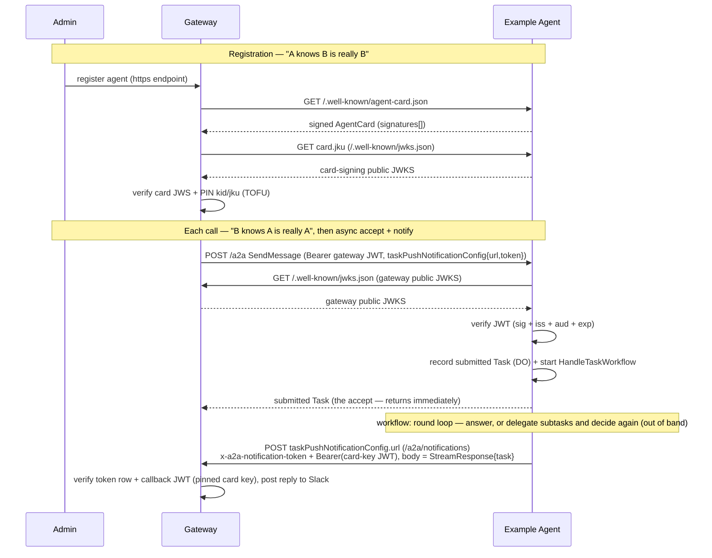
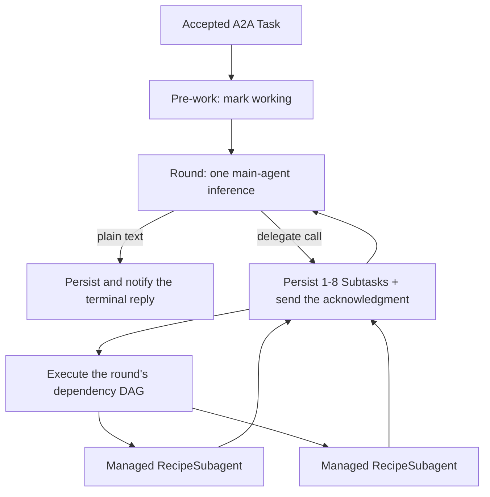

# Architecture

## The contract (both directions)

```mermaid
sequenceDiagram
    participant Admin
    participant Gateway
    participant Agent as Example Agent

    Note over Admin,Agent: Registration — "A knows B is really B"
    Admin->>Gateway: register agent (https endpoint)
    Gateway->>Agent: GET /.well-known/agent-card.json
    Agent-->>Gateway: signed AgentCard (signatures[])
    Gateway->>Agent: GET card.jku (/.well-known/jwks.json)
    Agent-->>Gateway: card-signing public JWKS
    Gateway->>Gateway: verify card JWS + PIN kid/jku (TOFU)

    Note over Admin,Agent: Each call — "B knows A is really A", then async accept + notify
    Gateway->>Agent: POST /a2a SendMessage (Bearer gateway JWT, taskPushNotificationConfig{url,token})
    Agent->>Gateway: GET /.well-known/jwks.json (gateway public JWKS)
    Gateway-->>Agent: gateway public JWKS
    Agent->>Agent: verify JWT (sig + iss + aud + exp)
    Agent->>Agent: record submitted Task (DO) + start HandleTaskWorkflow
    Agent-->>Gateway: submitted Task (the accept — returns immediately)
    Note over Agent: workflow: round loop — answer, or delegate subtasks and decide again (out of band)
    Agent->>Gateway: POST taskPushNotificationConfig.url (/a2a/notifications)<br/>x-a2a-notification-token + Bearer(card-key JWT), body = StreamResponse{task}
    Gateway->>Gateway: verify token row + callback JWT (pinned card key), post reply to Slack
```

This agent therefore does three things:

1. **Serves a signed AgentCard** at `/.well-known/agent-card.json`. The card is
   signed with a detached-payload EdDSA flattened JWS over its **JCS-canonical
   JSON** (the SDK's `generateAgentCardSignature`). The gateway verifies this and
   pins the signing key's `kid` + `jku` on first registration (Trust-On-First-Use).
2. **Publishes its card-signing public JWKS** at `/.well-known/jwks.json` (the
   card's `jku`), so the gateway can resolve the signing key.
3. **Verifies the gateway identity JWT** on every JSON-RPC call, resolving the
   gateway's public JWKS from the token's own `jku` header (RFC 7515 §4.1.2)
   and enforcing `iss`, `aud`, and `exp` against `GATEWAY_ORIGINS`.
   The verified caller identity is read from the namespaced
   `https://looping.ai/identity` claim and passed to the agent runtime.

> No secret is shared in either direction. The gateway proves it is the gateway
> with a signed JWT; this agent proves it is itself with a signed card. Each side
> only needs the other's **public** JWKS.

## Agent runtime (Durable Object + continuous Session)

Once the JWT is verified, [`src/index.ts`](src/index.ts) runs the A2A JSON-RPC
server for the call, and its [`A2AExecutor`](src/a2a/executor.ts) accepts the
turn into the [`ReactiveAgent`](src/reactive-agent/index.ts) Durable Object,
passing the **verified** caller identity as a typed argument — **one instance per
calling gateway-agent**, keyed by the verified `identity.key`. If the token
carries no `key` the Worker refuses the call (400): there is no shared/default
instance to route to.

The DO is the agent runtime. It extends the Agents-SDK `Agent` (itself a genuine
`DurableObject` subclass), so the Worker and the Workflow reach it over **native
Cloudflare RPC** with no internal HTTP or JSON-RPC layer: the DO is never exposed
over the network, only reachable from this Worker's own code. Its RPC surface is
a set of narrow, loop-shaped methods — `runTaskTurn`, `executeSubtaskChunk`,
`listSubtasks`, `skipBlockedSubtasks`, `failSubtask`, `cancelPendingSubtasks` for
the round loop, and `beginTask` / `getTask` / `saveTask` /
`markWorking` / `cancelTask` / `cleanupOldTasks` for Task state. Several of them
answer "was this canceled?" in their own return rather than making the caller ask
first — see **Failure and cancellation**. There is no
general "run a turn" entry point the outside world can reach: inference happens
only inside `runTaskTurn`, one round at a time. [`src/a2a/executor.ts`](src/a2a/executor.ts) is the only
A2A-protocol-aware piece on the Worker side: it records a `submitted` Task in the
caller's DO, starts the async delivery workflow, and publishes that Task as the
accept (see **Async task delivery** below). The DO backs a **Session** with
`this.sql`:

- **One continuous Session per caller** ([`src/agent/session.ts`](src/agent/session.ts)):
  a read-only `"soul"` identity block + a writable `"memory"` scratchpad the model
  self-edits (via the Session `set_context` tool), plus history. All of a caller's
  turns — across every channel/thread — accumulate into this single conversation.
  The agent is a **long-lived, reactive** partner: it responds to gateway turns
  instead of initiating outreach. Replies are delivered asynchronously (see **Async
  task delivery** below), and `this.schedule` is used for weekly data retention
  (see below).
- **Compaction** keeps the context lean: history is automatically compacted once
  it grows past `COMPACT_AFTER_TOKENS` (the Sessions `compactAfter` mechanism).
- **Episodic recall** ([`src/agent/recall.ts`](src/agent/recall.ts)): the raw
  messages each compaction displaces are embedded (Workers AI `@cf/baai/bge-m3`)
  and upserted into **Vectorize** via the Session's `onArchive` seam, namespaced
  per DO instance (the namespace is bound in code from the verified `identity.key`,
  never from model input). A `recall` tool then lets the model semantically search
  that archive for history that has scrolled out of the live context window. The
  tool is gated on "has compacted at least once", so it only appears once there is
  something to recall. Archival is best-effort — a Vectorize failure is swallowed so
  compaction still shortens history.
- **Model pair** ([`src/agent/model.ts`](src/agent/model.ts)): a primary + fallback
  Workers-AI model (via [`workers-ai-provider`](https://www.npmjs.com/package/workers-ai-provider)
  routed through an AI Gateway); also the compaction summarizer. Model ids, gateway
  slug, and Session tuning are constants in [`src/config.ts`](src/config.ts).
- **The round** ([`src/agent/turn.ts`](src/agent/turn.ts)): the one place the main
  agent infers over the Session. `runTurn` answers the user or delegates, with its
  own primary→fallback recovery. Shared model plumbing (transient-error
  classification, intermediate-content streaming) lives in
  [`src/agent/inference.ts`](src/agent/inference.ts).
- **Soul + caller context** ([`src/agent/prompt.ts`](src/agent/prompt.ts)): the frozen
  `"soul"` feeds the Session soul block; the verified caller is appended per turn as
  a system suffix. The prompt is aware of the gateway's `<turn>` provenance wrapper
  (parsed, never authored — see [`src/agent/history.ts`](src/agent/history.ts)).
- **Tools** ([`src/agent/tools.ts`](src/agent/tools.ts)): the main agent's work
  tools are the `browser_*` Quick Actions, the `recall` episodic-memory search, and
  the ARC scorecard lifecycle (`arc_list_games`, `arc_list_scorecards`,
  `arc_open_scorecard`, `arc_close_scorecard`), layered over the Session's own
  `set_context`/`load_context` — assembled per caller by `mainAgentTools`, and
  handed to **every** round. `recall` closes over the verified instance namespace,
  and the browser binding is closed over too, so neither can be spoofed from model
  input. Subagents get a **disjoint** set built by `buildRecipeTools` from their
  Recipe's tool families — `browser`, `workspace`, and `arc-game` (playing a game:
  reset/act/inspect, never opening or closing a scorecard).
  Per-call **authorization** policy for domain tools is still a later phase.

## The round loop

Every accepted Task runs a **round loop** in
[`src/workflows/handle-task.ts`](src/workflows/handle-task.ts). A round is one
main-agent inference that ends in one of two decisions: **answer the user** (the
Task is done) or **delegate** one to eight durable Subtasks, which run
concurrently in isolated subagents and come back as material for the next round.

```mermaid
flowchart TD
    A[Accepted A2A Task] --> P0[Pre-work: mark working]
    P0 --> T[Round: one main-agent inference]
    T -->|plain text| D[Persist and notify the terminal reply]
    T -->|delegate call| R[Persist 1-8 Subtasks + send the acknowledgment]
    R --> E[Execute the round's dependency DAG]
    E --> S1[Managed RecipeSubagent]
    E --> S2[Managed RecipeSubagent]
    S1 --> R
    S2 --> R
    R --> T
```

The durable step sequence is `working` → per round `turn:<round>` and, when that
round delegates, one wave per iteration (`scan:<round>:<wave>`, then per-branch a
loop of `execute:<id>` (chunk 0) and `execute:<id>:chunk:<n>` (n≥1) until done,
then `fail:<id>` on failure, or `cancel:<round>:<wave>` if the Task was canceled)
→ back to `turn:<round+1>` → `complete` → `notify`. **Those names are durable
cache keys** — renaming one silently re-runs its effect on replay, which is also
why every name inside the loop carries its round: two rounds sharing `scan:0`
would replay the first round's answer into the second.

> **The Subtask rows are the source of truth; Workflow state is not.** A `step.do`
> return is capped at **1 MiB**, and a Subtask carries verbatim reference
> snapshots bounded only by `MAX_INBOUND_TEXT_BYTES` (256 KB) — so steps return
> narrow projections (`SubtaskNode`: `{id, ordinal, status, dependsOn}`), never
> rows. Every round recovers by re-reading the database and the Session, which is
> also why replay is safe.

### The round ([`src/agent/turn.ts`](src/agent/turn.ts))

One `generateText` call with two layers of tools, and the difference between them
is the design:

- **Work tools** — `recall`, `browser_*`, `arc_*`, and the Session's own `set_context` —
  carry an `execute` and run _inside_ the round's loop, bounded by `MAX_STEPS`.
  They never end a round. **Every** round gets them, including the one that writes
  the final reply: looking something up before answering is ordinary work, not a
  special phase.
- **Control tools** — [`delegate`](src/agent/subtasks/delegate.ts) and
  [`final_reply`](src/agent/final-reply.ts) — have no `execute`. The call _is_ the
  round's output: the loop halts on it (there is nothing to continue from), and for
  `delegate` the Workflow performs it durably, over minutes or hours.

Nothing forces the _choice_ — a `final_reply` call is a terminal answer, a
`delegate` call is a decision to do work first, and the model picks. What is forced
is that the round end in a control call at all: `toolChoice` is `"required"`, and a
model that ends any other way has failed the attempt, so the fallback model runs.

Prose used to be the way a round answered, and that made narration
indistinguishable from an answer — a model that wrote "I'll start the game" and
emitted no call ended the Task successfully having done nothing. Weaker fallback
models did this constantly. Two named tools is also a far easier discrimination for
a small model than prose-versus-tool.

This is not a return to the earlier design that pinned `toolChoice` to a _specific
tool_, forcing delegation in one phase and forbidding it in the next. Both of those
were wrong in practice: a question about the agent's own history got shipped to a
memoryless subagent that could not see it, and material that came back could only
ever be turned into prose, never acted on. The model still chooses its own ending.

The one constraint is the budget. `MAX_TURN_ROUNDS` (8) bounds the loop, and the
last round — or any round of a Task that has already spent `MAX_CHUNKS_PER_TASK`
chunk steps — is handed `allowControl: false`: `delegate` is not declared at all,
so `final_reply` is the only ending left and the round must answer from what it
has. That is the whole termination argument.

Failure is graded rather than fatal. Both models producing nothing usable fails
the _Task_ only when there is no durable work behind it; with completed branches
in hand it degrades to `joinSuccessfulBranches`, delivering the work rather than
discarding it. A round whose every branch failed is **not** an automatic Task
failure either — the model sees the failed outcomes and says plainly what it could
not do, which beats a generic failure banner.

### Reuniting a delegation with its result

A later round sees each earlier round's delegation as what it was: the
**`delegate` call that round made**, paired with its result.
`renderTurnMessages` rebuilds both halves from the durable rows, anchored on the
acknowledgment's deterministic id (`task:<id>:round:<n>:ack`), and appends the
outcomes as the tool result. Nothing is fabricated — only a Workflow boundary
separated them. "Tool result → assistant decides what to do next" is a pattern
every instruction-tuned model knows, so it carries the facts this depends on (the
outcomes are generated output, not conversation evidence; it is now the model's
turn) without a prompt having to assert either.

`delegate` therefore has **one** declaration, whose schema serves both directions
— the calls the model emits now and the ones rebuilt from rows. A provider cannot
be shown two shapes for one tool name in a single request, which is exactly what a
separate "compose-time" declaration would have required. Reconstruction derives
each subtask's `localKey` from its durable id (`s<id>`) and omits
`referenceIndexes`, whose catalog is long gone.

The same pass numbers the referenceable turns `[ref 1..N]` for a delegation this
round might make. Round acknowledgments are deliberately _not_ referenceable: they
are the agent's own scaffolding, and they are already rendered as tool calls.

### Executing a round's DAG ([`src/agent/subtasks/scheduler.ts`](src/agent/subtasks/scheduler.ts))

`selectWave` picks every node whose dependencies completed; all of them run
concurrently (the eight-Subtask per-round maximum is the only fan-out bound). The
scheduler **does not re-validate the DAG**: `createDecomposition` already rejected
missing, self-referential, and cyclic edges before a row existed, and all three
manifest identically as _no progress possible_ — which the single "active nodes
but none ready" check already catches.

Scans are scoped to the round (`skipBlockedSubtasks(taskId, round)`). Dependency
edges never cross a round: each round's DAG is self-contained, and a later round
already has the earlier rounds' outputs in its model context, restating what it
needs in the new prompts.

### Escalation (not implemented)

A third decision — ask the human for approval or a multiple choice — is additive
by construction: another variant of `TurnDecision`, another `escalate` control
tool declared alongside `delegate`, and another `case` in the Workflow's loop that
posts an `input-required` Task and suspends on `step.waitForEvent(...)` before
continuing to the next round. Suspending mid-Task is the reason this pipeline is a
Workflow at all.

### Subtask contract and lifecycle

A Subtask is a durable row with three **distinct** input categories, kept
distinguishable all the way into the subagent's prompt:

| Input               | Origin                      | Rule                                                                               |
| ------------------- | --------------------------- | ---------------------------------------------------------------------------------- |
| `prompt`            | generated by the main agent | The only channel for summaries, recall, or tool output — at main-agent discretion. |
| `references`        | verbatim Session history    | Copied exactly; the model never rewrites, summarizes, or relabels them.            |
| `dependencyResults` | prerequisite Subtask output | Rendered explicitly as **generated output**, never as conversation evidence.       |

Status flows `pending` → `running` → one of `completed` · `failed` · `skipped` ·
`canceled`. Transitions are guarded (`UPDATE … WHERE status = <expected>` +
`.returning()`), so a disallowed transition is a no-op rather than a corruption.

**References are resolved once, when a round delegates.** At that point the
eligible live history turns are numbered `1..N` into an ephemeral catalog
([`src/agent/subtasks/catalog.ts`](src/agent/subtasks/catalog.ts)); the model
selects **indices only**, and application code copies each selected message's
exact role+text onto the row. Execution never re-reads the Session, so mid-task
compaction cannot affect a Subtask already in flight, and no rewritten "quote" can
reach a subagent. Compaction summaries are excluded from the catalog (the SDK's
`compaction_` message-id prefix) — readable as context, structurally uncitable as
evidence.

### Subtask types and their params

A **type** is the semantic contract of a unit of work: what it means, and what it
must be given to be doable at all. A **Recipe** is a different thing — the
execution _configuration_ a type runs under — and several types may share one.
Keeping them apart is why the params contract lives on the type.

The type set is **closed**, and each domain declares its own entry
(`recipes/<domain>/recipe.ts`) into the manifest at
[`src/recipes/index.ts`](src/recipes/index.ts).
[`src/agent/subtasks/subtask-types.ts`](src/agent/subtasks/subtask-types.ts) consumes
that list — lookup, the enum, param validation, the rendered catalogue — and names no
domain, so adding one is a new folder plus a line in the manifest, with no edit inside
`agent/`. `delegate`'s schema types the set as a `z.enum`, so an invented type is
rejected by the tool schema itself rather than silently resolving to the general
Recipe, and the model is shown each type with the params it requires.

A type may **require params** — the ids it cannot work without. `arc-game` requires
`card_id` and `game_id`, so a play that names neither is refused at delegation
instead of discovering several turns in that it has nothing to play. Params are
validated for _shape_ when the call is resolved, persisted on the row
(`params_json`), re-checked defensively in `executeChunk`, and gate the tool family
itself: no card and no game, no `arc-game` tools.

Params split by who can know them:

- **Declared** — ids the model chose, part of the execution's identity and
  therefore **fingerprinted**. The same prompt against a different scorecard is
  different work and must not replay a cached result.
- **Resolved** (`SubtaskRuntime`) — what the model can never supply, derived by the
  parent _from_ the declared params at execution start. Today that is the ARC
  cookie jar: the API pins a scorecard to the session that opened it, so a play is
  only possible with the jar stored on our own row. It travels as a separate
  `executeChunk` argument, like the chunk number, and is deliberately **not**
  fingerprinted — session state that changes under us must not make a retry look
  like a different request.

### Recipes

A Recipe configures one isolated subagent invocation: enabled state, version,
primary/fallback model ids, soul text, and tool families. It declares no params and
knows nothing about the types it serves. Every Recipe is a **code constant** under
[`src/recipes/<domain>/recipe.ts`](src/recipes/) — the general-purpose one is
`GENERAL_RECIPE` in [`src/recipes/general/recipe.ts`](src/recipes/general/recipe.ts),
sourcing model ids from [`src/config.ts`](src/config.ts) — not a database row, so it
cannot go stale against the configured models and needs no migration seed.

`resolveRecipeForType` maps type → Recipe (falling back to the manifest's
`FALLBACK_TYPE_SPEC` for a retired type still on a durable row) and is the seam a future
Recipe admin surface extends. `validateRecipe`
([`src/recipes/validation.ts`](src/recipes/validation.ts)) is the capability
boundary: the model allowlist is exactly the two config ids (a non-allowlisted id
is substituted with its slot's config default, independently per slot), unknown
tool families are dropped, and a Recipe that is disabled or carries no soul
throws. A soul is required, never defaulted: substituting a generic one would run
the work under an identity nobody declared. `recall` and the Session `set_context` tool are
**structurally impossible** for a subagent — they are never in the family map.
Recipe data never supplies arbitrary bindings, tools, or secrets. The resolved
Recipe id and version are recorded on the row after the fact, at execution start.

### Subagent lifecycle and retry safety

Each Subtask executes in a `RecipeSubagent` ([`src/subagent/`](src/subagent/)) —
an Agents-SDK **facet** created beneath the caller's `ReactiveAgent`, so it needs
no wrangler binding (it must only stay exported from `src/index.ts` so
`ctx.exports` can resolve it by class name). It has no Session, no durable memory,
no recall, and no access to parent history beyond the supplied references.

**One resumable runner, driven in durable chunks.** Every recipe — from a
single-shot default Subtask to a thousand-turn game — runs the same agentic loop
(`runResumableChunk`, [`src/subagent/run.ts`](src/subagent/run.ts)), customized
only by the recipe's `limits` (`maxTurns`/`turnsPerChunk`/`chunkSoftMs`) and
`historyWindow`. `executeChunk(request, chunk, runtime)` advances one chunk: up to
`turnsPerChunk` model turns (or `chunkSoftMs`, or until a tool emits progress),
checkpointing rolling state to a `run_state` row after every turn, then returning
either a terminal result or a `done: false` yield. The Workflow runs each chunk as
its own retryable `step.do` (`execute:<id>`, then `execute:<id>:chunk:<n>`) and
loops until done — so no step approaches the platform step timeout, and a crash
loses at most the in-flight turn. The general recipe sets
`maxTurns === turnsPerChunk`, so it finishes on chunk 0, byte-identical to the
pre-resumable pipeline. Domain behavior lives entirely in **tool families**; a
long recipe keeps only a small rolling context window and persists durable state
(hypotheses, plans, external-session ids) to its **workspace** — a file store
([`src/subagent/workspace.ts`](src/subagent/workspace.ts)) backed by
`@cloudflare/shell`'s `Workspace` over the facet's own SQLite, wiped with the
child on `deleteSubAgent`.

Retry safety rests on two mechanisms:

- **The child caches exactly one terminal result**, keyed by a SHA-256 fingerprint
  of the request ([`src/subagent/fingerprint.ts`](src/subagent/fingerprint.ts)).
  Terminal outcomes — completed **and** failed — replay with zero inference. A
  transient platform fault throws and caches **nothing**, so a Workflow retry
  re-runs inference by design. A _different_ request arriving at a child that
  already holds a result throws `FINGERPRINT_MISMATCH` (a message prefix, because
  error classes don't survive DO RPC), signalling a parent lifecycle bug.
- **Winning the `pending → running` claim is what distinguishes a fresh execution
  from a retry** — and that decides whether the child may be deleted. Claiming the
  row means fresh, so any stale child is deleted first. _Losing_ the claim with the
  row still `running` means a previous attempt crashed mid-execution, so the child
  is **not** deleted: its cache may hold the terminal result that makes the retry
  free. The child is deleted only **after** its result is durably copied into the
  parent — never before.

### Failure and cancellation

- A failed branch **skips its dependent descendants** (propagated to a fixpoint,
  bounded by the eight-Subtask maximum) while independent branches keep running.
- A branch that exhausts its step retries fails **the branch, not the Task**
  (`fail:<id>`), so composition can disclose the gap while its siblings keep the
  durable work they finished.
- If both models fail composition _deterministically_, `runCompose` joins the
  successful branches' text in ordinal order plus a fixed disclosure note and the
  Task completes. **Degrade rather than discard**: failing a Task whose branch work
  is already durable would throw away results the user asked for. Transient faults
  still throw for the step to retry.
- **Cancellation is a phase return, not a probe.** `CancelTask` converges on the
  DO's `markCanceled` from both entry points (the executor, and — the path that
  actually runs — the a2a-js handler's own cancel branch through `saveTask`).
  Every phase RPC then reports the verdict itself: `markWorking` returns
  `"canceled"`, `skipBlockedSubtasks` returns `{canceled}` alongside the wave, and
  `runTaskTurn` gained a `canceled` status. The Workflow reads
  those instead of issuing a separate `getTask` before each step, so a phase
  cannot act on a stale answer.
- A canceled row is **terminal**: `tasks.save` refuses every non-canceled write
  over it and returns whether it applied. Terminal delivery is keyed on that
  return, which is what actually prevents a `completed` callback racing a cancel —
  a check-then-save would leave a window both inside the `complete` step and
  between it and `notify`.
- Decomposition and composition re-read cancellation **after** their model call as
  well: no Subtask rows are persisted and no `working` callback is published for a
  Task the caller gave up on. Their reply may already be in the Session by then —
  durable history under a deterministic id, never published output.
- A canceled Task **interrupts work already in flight**. `markCanceled` calls
  `RecipeSubagent.abortRun` on every `running` Subtask's child, which aborts the
  `AbortSignal` passed to that chunk's `generateText`. An aborted run _yields_ — it
  never produces a terminal result — so nothing lands in the fingerprint cache and
  no fabricated failure can replay on a retry; the parent resolves the row with
  `cancelRunning` plus the tool families' `abort` hooks. Without this a long recipe
  would keep playing until its next chunk boundary (`chunkSoftMs`, minutes).
- A branch failed by the Workflow (`fail:<id>`) also runs its child's `abort` hooks
  before the sweep, so an abandoned run does not leak external state.
- Internal diagnostics stay on the row and in logs — the composition model is told
  _that_ a branch failed, not its stack trace, so it discloses the gap in user-safe
  words.

## Async task delivery (accept + notify)

The gateway dispatches remote agents **asynchronously** (A2A push notifications,
spec §13.2): it never blocks on generation. A `SendMessage` carries a
`configuration.taskPushNotificationConfig` (`{ url, token }` — the gateway's
`/a2a/notifications` webhook + a per-task validation token), the agent must
**accept immediately** with a `submitted`/`working` Task, and the reply is
delivered later by POSTing the terminal Task back to that webhook. A synchronous
`Message` reply from a remote agent is a protocol violation.

This agent implements that contract in three moving parts:

- **Accept (Worker).** [`src/index.ts`](src/index.ts) rejects a `SendMessage`
  without a `taskPushNotificationConfig` (JSON-RPC `-32602` — this agent is
  async-only), then the [`A2AExecutor`](src/a2a/executor.ts) records a `submitted`
  Task via the DO (`beginTask`, idempotent on the gateway's `messageId`), starts a
  [`HandleTaskWorkflow`](src/workflows/handle-task.ts) whose instance id is derived
  from that `messageId`, and publishes the Task as the accept — all in well under
  the gateway's 30s accept timeout. Task state persists in the DO
  ([`src/a2a/task-store.ts`](src/a2a/task-store.ts) backs the a2a-js `TaskStore`),
  so `GetTask` works across the accept→callback gap. Rows are retained for 30 days;
  `ReactiveAgent.cleanupOldTasks` runs as a weekly cron (Sunday 01:00 UTC) via the
  Agents SDK `this.schedule` API, registered idempotently in `onStart`.
- **Generate + deliver (Workflow).**
  [`src/workflows/handle-task.ts`](src/workflows/handle-task.ts) is the durable
  controller running the round loop above. Every step reaches the caller's DO by
  native RPC — a Workflow can't touch the DO's SQLite directly, so turn inputs
  ride as the workflow payload and task state is mutated only through DO RPC —
  and the last step POSTs the terminal Task to the gateway webhook. Steps are
  durable and retried; a future human-approval interrupt slots in as a
  `step.waitForEvent` between composition and delivery. Idempotency is layered:
  the deterministic instance id (a dispatch retry never starts a second run), the
  gateway's single-use callback token, and — because steps replay — **per-phase
  recovery from durable state**: `Session.appendMessage` dedupes by message id, so
  deterministic ids (`task:<id>:user`, `task:<id>:round:<n>:ack`,
  `task:<id>:reply:final`) make each round's append exactly-once; a re-run of
  `turn:<n>` recovers its rows and
  reply with zero inference; a chunk sequence (`execute:<id>` / `…:chunk:<n>`)
  recovers from the parent row or the child's fingerprint cache and run-state
  checkpoint.
- **Callback auth (`src/a2a/notify.ts`).** The callback is authenticated exactly
  like the AgentCard: a short-lived EdDSA JWT signed by `A2A_SIGNING_KEY` whose
  protected-header `kid`+`jku` **equal the card's** (the gateway pinned those at
  registration), with `aud` = the webhook URL. The terminal Task carries the reply
  in `status.message` (where the gateway's `extractText` reads it) — `completed`
  with the composed reply, or `failed` with **user-safe** text (the diagnostic
  stays on the Subtask row and in logs, never in the callback body). Progress
  replies are posted as `working` Tasks under stable semantic keys — `step:<n>`
  for tool-loop progress (`r<round>:step:<n>`), `ack:<round>` for a delegating
  round's acknowledgment, `final` for the
  terminal one — three namespaces that cannot collide. Still zero shared secrets:
  the gateway verifies against this agent's public JWKS.

## Durable state (SQLite + migrations)

Every DO instance owns a private SQLite database
([`src/db/schema.ts`](src/db/schema.ts)), reached through `AgentDB`
([`src/db/db.ts`](src/db/db.ts)) — one drizzle handle plus memoized per-table
namespaces (`db.tasks`, `db.subtasks`). Two tables:

| Table          | Role                                                                                         |
| -------------- | -------------------------------------------------------------------------------------------- |
| `notify_tasks` | A2A Task state across the accept→callback gap; answers `GetTask`.                            |
| `subtasks`     | One row per Subtask, tagged with the `round` that delegated it — the loop's source of truth. |

`subtasks` uses an SQLite `AUTOINCREMENT` integer primary key, so a `SubtaskId` is
caller-local, monotonic, and never reused after cleanup. It stores the parent task
id and `ordinal`, semantic type, nullable resolved Recipe id/version, the prompt,
`references_json` (verbatim role+text snapshots), `depends_on_json` (resolved
`SubtaskId`s), status, `result_parts_json`, an optional diagnostic error, and
timestamps. Both its indexes — `idx_subtasks_task_ordinal` (**unique**: the
schema-level backstop for idempotent creation) and `idx_subtasks_status` — are
declared **inline in the `sqliteTable` callback**; a standalone `index()` export
makes the pinned drizzle-kit emit a phantom `DROP INDEX`.

Creating a round's decomposition is atomic and idempotent on `(task id, round)`, wrapped in
an explicit synchronous `db.transaction`. DO write coalescing makes the durable
commit atomic but does **not** undo already-executed statements, which would
otherwise strand a truncated, edge-less DAG behind the idempotency guard.

Migrations follow the Agents SDK pattern: there is no global apply step, because
each instance has its own database — `AgentDB`'s constructor runs `migrate()`
(idempotent; Drizzle tracks applied migrations in `__drizzle_migrations`) and
`onStart()` forces that on every wake-up. Workers have no runtime filesystem, so
the generated SQL is bundled inline in
[`src/db/migrations/index.ts`](src/db/migrations/index.ts). Expired Tasks and their
Subtasks are cleaned up together after 30 days (both keyed on their own
`created_at`, written in the same Task lifecycle).

## Card canonicalization (owned by the SDK)

The card signature is computed over a **JCS (RFC 8785)** canonicalization of the
card with its `signatures` field excluded, then signed as a detached-payload
EdDSA flattened JWS.

Since A2A v1.0 this is the SDK's own contract, not ours:
[`src/a2a/card.ts`](src/a2a/card.ts) calls `generateAgentCardSignature` (which
canonicalizes via `canonicalizeAgentCard`), and the gateway verifies with the
matching `verifyAgentCardSignature`. Both sides run the same library code, so the
hand-rolled canonicalizer this project used to keep byte-for-byte in sync with
the gateway is gone.

One ordering rule survives and is load-bearing: **the card is converted with
`AgentCard.toJSON` before it is signed.** The verifier normalizes whatever it
receives through `AgentCard.toJSON(AgentCard.fromJSON(card))` before
canonicalizing, so signing the in-memory (protobuf-shaped) card covers different
bytes than the verifier checks and fails every time. `test/a2a/card.spec.ts` pins
this end-to-end against the SDK verifier.

## Environment

| Variable               | Where   | Purpose                                                                                                                                                                                                 |
| ---------------------- | ------- | ------------------------------------------------------------------------------------------------------------------------------------------------------------------------------------------------------- |
| `A2A_SIGNING_KEY`      | secret  | Ed25519 private JWK (with `kid`) that signs the AgentCard.                                                                                                                                              |
| `GATEWAY_ORIGINS`      | secret  | JSON array of trusted gateway origins, e.g. `["https://gw.example.com"]`. Validates `jku` and `iss`.                                                                                                    |
| `AI`                   | binding | Workers AI binding (routed via AI Gateway) backing every main-agent round, subagent execution, and recall embeddings.                                                                                   |
| `BROWSER`              | binding | Browser Rendering, backing the `browser` Recipe tool family (Quick Actions) subagents run with. **Requires a paid Workers plan — not on the free tier.**                                                |
| `ReactiveAgent`        | binding | Durable Object namespace — one instance per caller, holding the durable Session, Subtask rows, and task state. Managed `RecipeSubagent` facets are created beneath it and need no binding of their own. |
| `VECTORIZE`            | binding | Vectorize index (`reactive-agent-recall`, 1024-dim/cosine) storing per-instance episodic recall.                                                                                                        |
| `HANDLE_TASK_WORKFLOW` | binding | Cloudflare Workflow (`HandleTaskWorkflow`) that runs the five-phase pipeline and delivers the push callback.                                                                                            |

> The recall index is created out of band before deploy (it must match the
> embedding model's output):
> `wrangler vectorize create reactive-agent-recall --dimensions=1024 --metric=cosine`.
> Vectorize has no local-development mode, so `npm run dev` prints a warning and
> the test suite injects a fake index rather than binding a real one.

## Known risks (unverified against real infrastructure)

The test suite is deliberately **hermetic** — no network, no real inference — so
a few things are proven only by construction and stay unverified until production
traffic. They are characteristics, not known bugs; none is a correctness hole.

1. **The control tool calls, on both ends — and the unforced choice.** A round
   needs the real models to call `delegate` or `final_reply` and fill the schema,
   and a later round gets a history containing the `delegate` call paired with a
   `tool` result. `test/agent/turn.spec.ts` asserts every shape reaches the
   provider, but a mock model cannot prove `@cf/zai-org/glm-4.7-flash` and
   `@cf/moonshotai/kimi-k2.7-code` **honor** them. `toolChoice: "required"` closes
   the failure mode where a model narrated instead of acting, but it cannot make a
   model _judge_ well — delegating work it cannot do, and answering what it can.
   Failure stays graceful (a round that lands on no control call exhausts both
   models; a later round that mishandles the pair falls through to
   `joinSuccessfulBranches`), so the thing to watch in the first live tasks is not
   crashes but **choices**: read the AI Gateway logs for rounds that answered when
   they should have delegated. A model that ignores `required` outright would show
   up as rounds failing with `round produced no decision`.
2. **Chunk-step timing and the resumable runner.** A chunk runs at most
   `turnsPerChunk` model turns bounded by `chunkSoftMs` (~4 min for the ARC
   recipe), well under the platform's default 10-minute step timeout, and it
   checkpoints after every turn — so unlike the old whole-loop step, a timeout or
   crash resumes from the last turn instead of replaying the chunk. What stays
   unverified without production traffic is whether the chat models sustain
   coherent tool-driven play over hundreds of turns (dithering, malformed calls,
   context drift) — the metrics footer (turns / model calls / wall-clock) and AI
   Gateway logs make it observable; tune `limits`/`historyWindow`/soul with
   evidence. `MAX_CHUNKS_PER_BRANCH` (80) bounds a single branch against the
   10,000 step-per-instance ceiling, and `MAX_CHUNKS_PER_TASK` (120), checked
   between rounds, stops a Task that delegates repeatedly from multiplying it. The
   ARC recipe's 1,000 turns at 25 per chunk is 40 nominal chunks, leaving an equal
   margin for the level-up progress events that end a chunk early — a _very_ busy
   game could still hit the cap, which fails that branch with its metrics footer
   and hands the next round an honest gap to disclose. Tune with real metrics.
3. **Non-idempotent game moves across a crash.** The ARC API has no read-only
   "current frame" endpoint, so `arc_act` writes a **write-ahead intent** to the
   workspace before sending an action and clears it after. A crash in that window
   may leave a move that was sent but not recorded; on resume the tool annotates
   the anomaly ("may have been interrupted") rather than reconciling. This is an
   accepted residual — at most one possibly-duplicated move per crash. One
   `arc_act` call may now carry a **sequence** of up to 8 actions, and that bound
   still holds: a batch is not atomic, the intent is written and cleared per step,
   so a crash mid-sequence exposes exactly the same one-move window as a crash
   mid-action, with the steps before it already recorded. Separately,
   nothing auto-closes a scorecard any more: the main agent opens and closes them,
   so a card can be left open if it never gets around to closing one. That is
   deliberate (a subagent must not end a card it does not own, and one card spans
   many plays), and an open card stays discoverable — it is a row in `scorecards`,
   listed by `arc_list_scorecards` and injected into every round's context. Two
   rules code cannot enforce are stated in the soul instead: give concurrent plays
   of the same game different cards, and do not close a card while its plays run.
4. **Mid-flight cancellation depends on RPC delivery during a model `fetch`.**
   `markCanceled` reaches a `RecipeSubagent` with `abortRun` while that facet is
   inside `executeChunk`, which only works because the facet is awaiting a
   provider `fetch` — an await that does not hold the input gate closed. The
   hermetic suite proves the _runner's_ half (an aborted signal yields, spends one
   model call, and caches nothing) but cannot prove the delivery itself. If the
   RPC does not land, the abort silently never fires and cancellation degrades to
   the pre-existing chunk-boundary polling: slower, never incorrect. Watch the
   first live `CancelTask` of an ARC game — model calls should stop within
   seconds, not at the next ~4-minute boundary.
5. **`@cloudflare/shell` is experimental.** The workspace is backed by shell's
   `Workspace` ("API surface still settling"). The blast radius is contained to the
   narrow `WorkspaceHandle` wrapper (the only shell import) and a pinned version.
6. **Subagent observability depends on AI Gateway logging.** The schema persists no
   step log by design — subagent tool activity is observed through Cloudflare AI
   Gateway. `AI_GATEWAY_ID` is `"default"` (auto-provisioned on first request), so
   if logging is off for that gateway, that activity is invisible.

## Files

| File                                                                         | Role                                                                                                                                                                                                                |
| ---------------------------------------------------------------------------- | ------------------------------------------------------------------------------------------------------------------------------------------------------------------------------------------------------------------- |
| [`src/index.ts`](src/index.ts)                                               | Worker entry: card / JWKS; verifies JWT, then runs the A2A JSON-RPC server dispatching into the caller's DO.                                                                                                        |
| [`src/a2a/card.ts`](src/a2a/card.ts)                                         | Build + sign the AgentCard; derive public JWKS; parse signing key.                                                                                                                                                  |
| [`src/a2a/verify.ts`](src/a2a/verify.ts)                                     | Verify the gateway identity JWT.                                                                                                                                                                                    |
| [`src/reactive-agent/index.ts`](src/reactive-agent/index.ts)                 | `ReactiveAgent` DO — owns the caller's Session, the round-loop RPCs (`runTaskTurn`/`executeSubtaskChunk`/`skipBlockedSubtasks`, …), and durable async task state (`beginTask`, …).                                  |
| [`src/a2a/task.ts`](src/a2a/task.ts)                                         | `PlainTask` — SDK `Task` minus `unknown` extension `metadata`, so DO-RPC `Task` returns don't collapse to `never`.                                                                                                  |
| [`src/agent/session.ts`](src/agent/session.ts)                               | The continuous Session (soul + memory + compaction).                                                                                                                                                                |
| [`src/a2a/executor.ts`](src/a2a/executor.ts)                                 | `A2AExecutor` — accepts a turn (submitted Task) and starts the notify workflow.                                                                                                                                     |
| [`src/a2a/task-store.ts`](src/a2a/task-store.ts)                             | `DurableTaskStore` — DO-backed a2a-js `TaskStore` (durable task state across accept→callback).                                                                                                                      |
| [`src/a2a/notify.ts`](src/a2a/notify.ts)                                     | Build the submitted/completed Tasks; sign + POST the gateway push-notification callback.                                                                                                                            |
| [`src/workflows/handle-task.ts`](src/workflows/handle-task.ts)               | `HandleTaskWorkflow` — durable controller for the round loop: `working` → `turn:<round>` → `scan`/`execute` → next round → `complete` → `notify`.                                                                   |
| [`src/agent/turn.ts`](src/agent/turn.ts)                                     | One main-agent round — `runTurn`: answer in plain text, or call `delegate` for 1-8 Subtask drafts. `renderTurnMessages` reunites earlier rounds' calls with their results; deterministic-join degradation.          |
| [`src/agent/inference.ts`](src/agent/inference.ts)                           | Shared model plumbing: `isTransientAiError`, `buildIntermediateContentHandler`, `OnContent`.                                                                                                                        |
| [`src/agent/subtasks/types.ts`](src/agent/subtasks/types.ts)                 | RPC-safe Subtask contracts (`Subtask`, `SubtaskReference`, `RecipeExecutionRequest`, `SubtaskNode`, …).                                                                                                             |
| [`src/agent/subtasks/catalog.ts`](src/agent/subtasks/catalog.ts)             | `buildReferenceCatalog` — the ephemeral 1..N numbering of eligible history turns (compaction summaries excluded).                                                                                                   |
| [`src/agent/subtasks/decomposition.ts`](src/agent/subtasks/decomposition.ts) | `decompositionProposalSchema` + `resolveDecomposition` — index-only reference resolution and DAG validation.                                                                                                        |
| [`src/agent/subtasks/scheduler.ts`](src/agent/subtasks/scheduler.ts)         | `selectWave` — pure DAG wave selection (ready / done / stuck).                                                                                                                                                      |
| [`src/subagent/index.ts`](src/subagent/index.ts)                             | `RecipeSubagent` — the managed facet; `executeChunk(request, chunk)` + `abortRun` (interrupt in flight) + `abortExecution` (release external state) + the fingerprint-keyed terminal cache and rolling `run_state`. |
| [`src/subagent/run.ts`](src/subagent/run.ts)                                 | `runResumableChunk` — the one durable-chunk runner (agentic loop, per-turn checkpoint, budget-exhaustion summary, abort-yields-nothing); `runRecipeExecution` runs it to completion.                                |
| [`src/subagent/workspace.ts`](src/subagent/workspace.ts)                     | `WorkspaceHandle` over `@cloudflare/shell`'s `Workspace` (facet SQLite) — the recipe's durable file store; the sole shell import surface, with size/count caps.                                                     |
| [`src/subagent/prompt.ts`](src/subagent/prompt.ts)                           | `renderSubagentPrompt` — soul as system; sectioned user message keeping references and dependency output distinct.                                                                                                  |
| [`src/subagent/fingerprint.ts`](src/subagent/fingerprint.ts)                 | Deterministic SHA-256 request fingerprint keying the child's retry cache and run state.                                                                                                                             |
| [`src/recipes/index.ts`](src/recipes/index.ts)                               | The Subtask type manifest: `SUBTASK_TYPE_SPECS` + `FALLBACK_TYPE_SPEC` — the only module that knows which domains exist.                                                                                            |
| [`src/recipes/types.ts`](src/recipes/types.ts)                               | Recipe-side contracts owned by `recipes/` and consumed by `agent/`: `ResolvedRecipe`, `RecipeLimits`, `SubtaskParams`, `SubtaskTypeSpec`.                                                                           |
| [`src/recipes/validation.ts`](src/recipes/validation.ts)                     | `validateRecipe` + the model/tool-family allowlists — the capability boundary every Recipe passes through; imports no domain.                                                                                       |
| [`src/recipes/general/`](src/recipes/general/)                               | The general recipe domain: `recipe.ts` (`GENERAL_TYPE`, `GENERAL_RECIPE`, `GENERAL_SPEC`) · `soul.ts` (`GENERAL_SUBAGENT_SOUL`) — the recipe for work with no domain of its own.                                    |
| [`src/recipes/arc-game/`](src/recipes/arc-game/)                             | First domain recipe: `recipe.ts` (`ARC_GAME_RECIPE` + `ARC_GAME_SPEC`) · `soul.ts` · `client.ts` (ARC-AGI-3 REST + cookie jar) · `analysis.ts` (pure grid helpers) · `tools.ts` (`arc-game` family).                |
| [`src/db/schema.ts`](src/db/schema.ts)                                       | Drizzle tables: `notify_tasks` + `subtasks` (indexes declared inline — see **Durable state**).                                                                                                                      |
| [`src/db/db.ts`](src/db/db.ts)                                               | `AgentDB` — one drizzle handle over the DO's SQLite + `db.tasks` / `db.subtasks`; runs `migrate()` on construction.                                                                                                 |
| [`src/db/models/tasks.ts`](src/db/models/tasks.ts)                           | `notify_tasks` query methods (`begin`/`get`/`save`/`markWorking`/`cancel`/`cleanup`).                                                                                                                               |
| [`src/db/models/subtasks.ts`](src/db/models/subtasks.ts)                     | Subtask query methods: atomic idempotent `createDecomposition`, guarded transitions, cleanup.                                                                                                                       |
| [`src/db/migrations/`](src/db/migrations/)                                   | Generated SQL + journal, bundled inline in `index.ts` (no runtime filesystem in Workers).                                                                                                                           |
| [`src/agent/model.ts`](src/agent/model.ts)                                   | Workers-AI primary/fallback model pair (via AI Gateway), parameterizable per Recipe.                                                                                                                                |
| [`src/agent/prompt.ts`](src/agent/prompt.ts)                                 | Soul (identity + rules) + per-request caller context.                                                                                                                                                               |
| [`src/agent/tools.ts`](src/agent/tools.ts)                                   | `buildTools` (main-agent work tools: gated `browser_*` + `recall`) and `buildRecipeTools` (subagents: `browser`, `workspace`, domain families).                                                                     |
| [`src/agent/recall.ts`](src/agent/recall.ts)                                 | Episodic recall: embed + upsert compacted-away messages to Vectorize; semantic search.                                                                                                                              |
| [`src/a2a/inbound.ts`](src/a2a/inbound.ts)                                   | Inbound A2A message → text (`textOf` / `inboundText`, size-bounded) — the one place touching the `@a2a-js/sdk` message shape.                                                                                       |
| [`src/agent/history.ts`](src/agent/history.ts)                               | `<turn>` provenance parsing + deterministic Session-message ids (the exactly-once append seam).                                                                                                                     |
| [`src/config.ts`](src/config.ts)                                             | Model ids, AI Gateway slug, `MAX_STEPS` / `MAX_SUBTASKS` bounds, Session/compaction tuning.                                                                                                                         |
| [`src/reactive-agent/manifest.ts`](src/reactive-agent/manifest.ts)           | AgentCard identity + advertised skills.                                                                                                                                                                             |
| [`scripts/generate-keys.mjs`](scripts/generate-keys.mjs)                     | Ed25519 JWK keypair generator.                                                                                                                                                                                      |
