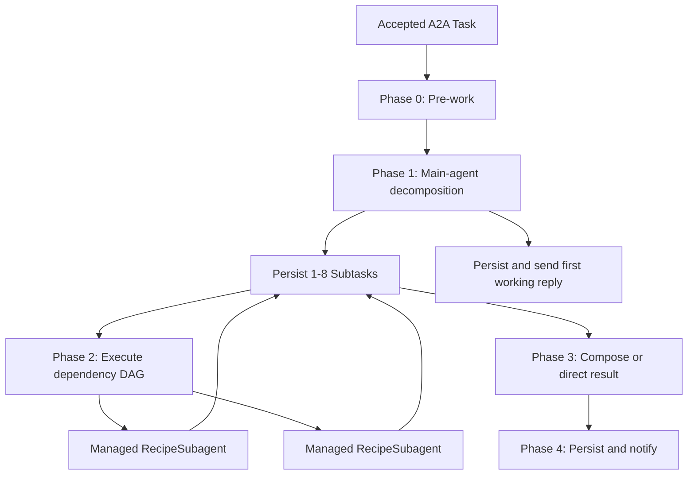

# Phased Task Recipes and Subagents

## Goal

Refactor `HandleTaskWorkflow` into five explicit runtime phases:

0. Pre-work
1. Decompose Task
2. Execute Subtasks
3. Compose Task
4. Deliver Task

The caller-owned `ReactiveAgent` remains the durable main agent and owner of the continuous Session. Every incoming Task is decomposed into one to eight durable Subtasks. Dependency-ready Subtasks run concurrently through code-owned Recipe configuration and isolated Agents SDK subagents. The main agent composes multiple outcomes, while a single successful Subtask bypasses composition. Phase 4 retains the signed asynchronous A2A delivery contract.

## Status

Legend: ✅ done · 🚧 partial · ⬜ not started. Section headings below carry the same marker.

- ✅ **A1** contracts · ✅ **A2** text ingress · ✅ **A3** reference catalog · ✅ **A4** durable Subtask storage
- ✅ **Phase B** (code-owned Recipe validation + managed Subagents) · ✅ **Phase C** (decomposition + composition) · ✅ **Phase D** (Workflow DAG) · ✅ **Phase E** (verification + docs)

**This plan is complete.** Its durable design rationale now lives in
`ARCHITECTURE.md` and `AGENTS.md`; what remains here is the historical record of
how the phases were reasoned through, including the deletions (`converse`,
`runTurn`, `loop.ts`) that the `## Status` and "As built" notes reference. Two
characteristics were consciously left unverified — see **Phase E** and
ARCHITECTURE.md → _Known risks_.

A1's contracts landed incrementally with their consumers: the execution request/result shapes with Phase B, the decomposition and composition shapes with Phase C.

Phase D rewired `src/workflows/handle-task.ts` onto the RPCs C landed and deleted
`converse` — the pipeline is now the only inference path in the repository.

## Core Invariants

- Every accepted parent Task has between one and eight Subtasks after Phase 1.
- Subtasks are durable rows in the caller's `ReactiveAgent` SQLite database. Workflow state is not their source of truth.
- A Subtask has three distinct input categories:
  - `prompt`: a non-session instruction generated by the main agent.
  - `references`: exact, verbatim snapshots of selected Session history messages, copied onto the Subtask at decomposition time.
  - `dependencyResults`: generated output from prerequisite Subtasks.
- At decomposition time, application code numbers the eligible live Session history messages `1..N` — an ephemeral, per-decomposition catalog. Eligible messages are the verbatim `user` and `assistant` turns. Compaction summaries (identified by the SDK's `compaction_` message-id prefix via `isCompactionMessage` from `agents/experimental/memory/utils`), recall results, and system/context blocks are excluded because they never appear as plain history messages in this repo.
- The decomposition model selects catalog indices only. Application code copies each selected message's exact text verbatim onto the Subtask; the model never rewrites, summarizes, fabricates, or relabels reference content.
- References are resolved and persisted once, at decomposition. Execution never re-reads the Session, so mid-task compaction cannot affect a Subtask already in flight. There are no durable part IDs, no lazy resolution, and no second-copy concern.
- Information about summaries, recall, or tool output can reach a Subtask only through the `prompt` input, at main-agent discretion.
- A Recipe configures an isolated subagent invocation: an enabled state, version, primary/fallback model ID strings, soul text, and a set of tool families. The `default` Recipe is a **code constant** (`DEFAULT_RECIPE` in `src/agent/subtasks/recipe.ts`, sourced from `config.ts`), not a database row — so it never goes stale against the configured model IDs and needs no migration seed. Caller-local database Recipe rows and semantic-type associations are deferred until a Recipe admin surface (a real writer) exists — see Out of Scope.
- Decomposition assigns only a semantic Subtask `type`; it never names a Recipe. When a pending Subtask starts, its type resolves to one enabled Recipe via the code-owned `resolveRecipeForType` — always the `default` Recipe until caller-local associations exist.
- The resolved Recipe ID and version are recorded on the Subtask after-the-fact, at execution start. Model IDs and tool families remain code-validated (`validateRecipe`): the model allowlist is exactly the two config IDs, a non-allowlisted ID is substituted with its slot's config default independently per slot, unknown or removed tool families are ignored, and `recall` and Session `set_context` are never Recipe-selectable.
- Subagents have no Session, durable memory, recall access, or access to parent history beyond the supplied references.
- Managed subagents are deleted with `deleteSubAgent()` after their terminal result is durably copied into the parent.
- Dependency edges form a validated DAG through `dependsOn: SubtaskId[]`.
- All ready Subtasks run concurrently. The maximum of eight Subtasks bounds fan-out.
- Failure of one branch skips its dependent descendants but does not stop independent branches.
- Parent cancellation stops new work and propagates into pending Subtask states. Already-running model calls are best effort, and late results are discarded.

## Target Flow



## Phase A: Contracts, References, and Persistence — ✅ done (A1 completed by C)

### A1. Define RPC-safe Subtask contracts — ✅ done

> Core contracts (`SubtaskStatus`, `SubtaskId`, `SubtaskReference`, `SubtaskResultPart`, `Subtask`) are in `src/agent/subtasks/types.ts`, along with `SubtaskDraft` and `ResolvedRecipe` (added by A4). Phase B added the execution contracts it consumes (`DependencyResult`, `RecipeExecutionRequest`, `RecipeExecutionResult`). Phase C added the last of them, alongside the operations that consume them: `SubtaskProposal` and `DecompositionProposal` (the model's structured output), `DecomposeTaskResult`, `CompositionBranch`, and `ComposeTaskResult`. Each contract landed with its consumer rather than up front — the phase that uses a shape is the one that knows what it needs.

Add `src/agent/subtasks/types.ts` with plain, serializable contracts suitable for native Durable Object RPC.

Define:

- `SubtaskStatus`:
  - `pending`
  - `running`
  - `completed`
  - `failed`
  - `skipped`
  - `canceled`
- `SubtaskId`: a caller-local, SQLite-assigned, monotonically increasing numeric identifier.
- `SubtaskReference`: an exact, verbatim snapshot of one selected Session history message — its `role` (`user` | `assistant`) and its `text`. Copied onto the Subtask at decomposition; the model never rewrites it. User-turn provenance is already inline in the message text's `<turn>` wrapper.
- `SubtaskResultPart`: `{ kind: "text"; text }`. A single-kind union today; file/data kinds are additive later. Internal to the agent — the terminal A2A Task collapses these to one text reply.
- `Subtask`:
  - Numeric `id: SubtaskId`
  - Parent `taskId`
  - `ordinal`
  - Semantic `type`
  - Nullable resolved Recipe ID and version, written only when execution starts
  - Non-session `prompt`
  - Immutable `references: SubtaskReference[]`
  - `dependsOn: SubtaskId[]`
  - `status`
  - `resultParts: SubtaskResultPart[] | null`
  - Optional diagnostic `error`
  - `createdAt`
  - `updatedAt`
  - Nullable `completedAt`
- Decomposition drafts and output.
- Dependency-result records.
- Recipe execution request and result.
- Composition input and output.

Successful Recipe output must include at least one non-empty text result part.

### A2. Validate text-only ingress — ✅ done

Keep `src/a2a/inbound.ts` focused on plain text; file and data parts are out of scope (see "Explicitly Out of Scope").

- Retain `textOf()` for the main Session representation.
- Add `inboundText()`: extract the trimmed user-turn text, reject a message with no usable text, and enforce a single `MAX_INBOUND_TEXT_BYTES` UTF-8 bound before the text enters a Workflow payload.
- The executor passes only `text` in `HandleTaskParams`; there is no `parts` field.

### A3. Build the ephemeral decomposition-time reference catalog — ✅ done

> Implemented as `buildReferenceCatalog` in `src/agent/subtasks/catalog.ts` (tests in `test/agent/subtasks/catalog.spec.ts`).

Add a small pure helper, used only inside Phase 1, that turns the live Session history into a numbered reference catalog. No database changes, no Session changes, no new persistent IDs, and no new RPCs.

- Input: the messages from `Session.getHistory()`. The inbound user turn has already been appended (C1 step 1), so one catalog covers both the current task input and past turns.
- Number the eligible messages `1..N` (ephemeral, per-decomposition). Eligible messages are the verbatim `user` and `assistant` turns.
- Exclude compaction summaries — identified by the SDK's `compaction_` message-id prefix via `isCompactionMessage` from `agents/experimental/memory/utils`. Recall results, system prompts, and context blocks are structurally excluded because they never appear as plain history messages in this repo.
- Each catalog entry carries its index, `role`, and exact `text`.

The main agent may read summaries and recall while reasoning, but it delegates only by selecting catalog indices. The selected messages' text is snapshotted onto the Subtask at decomposition (see C1), so nothing is resolved lazily and compaction cannot affect a Subtask in flight.

### A4. Add durable Subtask storage — ✅ done

> **As built — deviates from the original design (user-approved).** The `default`
> Recipe lives in code, not the database, and A4 creates **only** the `subtasks`
> table. A DB row that re-encodes code constants (model IDs, soul, tool families)
> was rejected as liability: it goes stale against `config.ts`, needs a
> hand-appended migration `INSERT`, and forms a second source of truth. With the
> default in code and recipe mutation Out of Scope, the `recipes` /
> `subtask_type_recipes` tables would be created empty and stay empty — so they
> are **deferred until a Recipe admin surface (a real writer) exists**. Phase B
> re-examined and kept this call: B1 had no real writer either (see Phase B note).

Extend `src/db/schema.ts` with a caller-local `subtasks` table. It uses an SQLite
integer primary key (`AUTOINCREMENT`) to assign a unique, monotonically
increasing `SubtaskId` — never reused after cleanup deletes rows — within the
caller's main-agent database, and is indexed by parent Task/order
(`idx_subtasks_task_ordinal`, **unique** — the schema-level backstop for
idempotent creation) and status (`idx_subtasks_status`). Both indexes are
declared inline in the `sqliteTable` callback (a standalone `index()` export makes
the pinned drizzle-kit emit a phantom `DROP INDEX`).

Persist:

- Parent Task ID and ordinal.
- Semantic type and nullable resolved Recipe ID/version (written only at execution start).
- Non-session prompt.
- Reference snapshots JSON (`references_json`): the exact role+text of the selected messages.
- Dependencies JSON (`depends_on_json`): resolved `SubtaskId`s.
- Status and result parts JSON (`result_parts_json`, text-only).
- Error and timestamps.

Add the code-owned default Recipe in `src/agent/subtasks/recipe.ts` (not a
`src/recipes/` registry): `DEFAULT_RECIPE` (model IDs from `config.ts`, a
`STATELESS_SUBAGENT_SOUL`, and the `browser` tool family) plus
`resolveRecipeForType(type)`, which returns the default and is the seam a
future Recipe admin phase extends to consult the DB.

Add `src/db/models/subtasks.ts` with:

- Atomic, idempotent (keyed on parent Task ID) creation of the full decomposition, resolving draft-local dependency keys to SQLite-assigned `SubtaskId`s and enforcing the 1–8 bound. Atomicity comes from an explicit synchronous `db.transaction` (drizzle maps it to `storage.transactionSync`), so a mid-create failure rolls back every statement — DO write coalescing alone makes the durable commit atomic but does not undo already-executed statements, which would otherwise strand a truncated or edge-less partial DAG behind the idempotency guard.
- `get` and ordered `list` methods.
- Guarded status transitions (`UPDATE … WHERE status = <expected>` + `.returning()`, so a disallowed transition is a no-op).
- Completion/failure result persistence (completion requires a non-empty text part).
- Skip and cancellation transitions (`cancelPending` cancels only still-pending Subtasks).
- Parent cleanup support.

Recipe resolution and execution-time recording (`resolveRecipeForType(type)` then
the `pending → running` transition that records Recipe ID/version) are composed by
the caller in C3 — kept as two synchronous calls rather than coupling recipe logic
into the subtask-table writer; still atomic. Recipe version increments and DB-backed
type-mapping lookup arrive with the recipe tables (deferred past this plan).

Wire the data layer as `db.subtasks` in `src/db/db.ts`. Extend the existing 30-day
cleanup so expired parent Task rows and their Subtasks are removed together (both
keyed on their own `created_at`, written in the same Task lifecycle).

Generate the Drizzle migration with `npx drizzle-kit generate`, preserve generated
SQL and metadata, and mirror the SQL and journal entry into
`src/db/migrations/index.ts`. No manual SQL edits (no seed), so a later `generate`
stays clean.

### Phase A Exit Criteria

- Inbound text survives executor-to-Workflow RPC; empty and oversize messages are rejected before the Workflow starts.
- The ephemeral catalog numbers only eligible history turns and excludes compaction summaries.
- Selected references are snapshotted onto Subtask rows at decomposition; execution never re-reads the Session.
- Subtask creation is idempotent and constrained to one through eight nodes.
- Invalid states and invalid JSON payloads are rejected before persistence.
- Focused ingress and database tests pass.

## Phase B: Code-Owned Recipe Contracts and Managed Subagents — ✅ done

> **As decided — supersedes the original "Database-backed Recipe Configuration"
> (user-approved, 2026-07-15).** The `recipes` / `subtask_type_recipes` tables are
> deferred **again**, past this plan: Recipe administration is Out of Scope, so
> nothing would ever write them, and production behavior is identical without
> them — every Subtask type resolves to the code-owned `DEFAULT_RECIPE`. The same
> "no writer, no table" rationale that moved the tables out of A4 applies to B1.
> They land in a future phase together with a real admin writer;
> `resolveRecipeForType` remains the seam. The model allowlist is deliberately
> exactly the two config IDs — the only models proven with this pipeline.

### B1. Recipe execution contracts and code-owned validation — ✅ done

Add the deferred A1 contracts Phase B consumes to `src/agent/subtasks/types.ts`:

- `DependencyResult`: `{ subtaskId, type, resultParts }` — generated output of one
  completed prerequisite Subtask; `type` only labels the rendered section.
- `RecipeExecutionRequest`: `{ taskId, subtaskId, recipe, prompt, references, dependencyResults }` — RPC-safe input for one isolated execution.
- `RecipeExecutionResult`: terminal `completed` (≥1 non-empty text part) or
  `failed` (diagnostic `error`), each with a diagnostic `modelId` (nullable on
  `failed`; never persisted on the Subtask row).

Add code-owned validation in `src/agent/subtasks/recipe.ts`:

- `SUBAGENT_MODEL_ALLOWLIST` — exactly `CHAT_MODEL_ID` and `CHAT_FALLBACK_MODEL_ID`.
- `KNOWN_TOOL_FAMILIES` — `browser` only; `recall` and Session `set_context` are
  structurally impossible (never in the map).
- `validateRecipe(recipe)` — pure, returns a normalized copy: a non-allowlisted
  model ID is substituted with its slot's config default independently per slot;
  unknown tool families are dropped (deduped, order-preserving); a blank soul
  falls back to `STATELESS_SUBAGENT_SOUL`; a disabled Recipe throws
  `RecipeValidationError` (the child maps it to a terminal failed result).

Parameterize `createModelPair` (`src/agent/model.ts`) with optional
`primaryModelId` / `fallbackModelId` (pre-validated — `validateRecipe` is the
single validation owner); `primaryId()` / `fallbackId()` report the per-Recipe
IDs. Add `buildRecipeTools(toolFamilies, browser?)` to `src/agent/tools.ts`,
reusing `buildBrowserTools` and gating on binding presence. Recipe data never
provides arbitrary bindings, tools, or secrets.

### B2. Add `RecipeSubagent` — ✅ done

The `src/subagent/` module, exported from `src/index.ts` — required so
`ctx.exports` can resolve the facet class by name. **No production wrangler
changes**: no `durable_objects` binding, no `new_sqlite_classes` entry; facets
are created beneath the bound `ReactiveAgent`.

- `prompt.ts` — `renderSubagentPrompt(request)`: pure and deterministic. The
  validated Recipe soul verbatim as the system prompt; a sectioned user message
  (`# Task`, `# Conversation references` with `[ref N] (role):` verbatim
  snapshots, `# Dependency results` explicitly labeled as generated output —
  never conversation evidence); empty sections omitted. No summarizing,
  rewriting, or interpolation; user-turn provenance is already inline in the
  reference text.
- `run.ts` — `runRecipeExecution(request, deps)`: the Session-less bounded loop
  (`generateText`, `stopWhen: stepCountIs(MAX_STEPS)`, `maxRetries: 0`),
  deliberately not extracted from the Session-coupled `runTurn`. An empty prompt
  fails without inference; an attempt succeeds only on a non-empty, non-truncated
  final text; primary → fallback on any failure; with both exhausted, a transient
  fault (`isTransientAiError`) is rethrown for the Workflow step and everything
  else returns a terminal `failed` result carrying both diagnostics.
- `index.ts` — `RecipeSubagent extends Agent<Env>` with the single RPC
  `execute(request)`. It never constructs a Session, never reads parent history
  beyond the supplied references, never uses recall or durable memory, never
  resolves a Recipe by type, and accepts no configuration beyond the parent's
  resolved Recipe data (defensively re-validated with `validateRecipe`).
  `subagentName(taskId, subtaskId)` → `subtask:<taskId>:<subtaskId>` is the
  child-name convention shared with C3. A test-only `modelsOverride?: ModelPair`
  field (never on the RPC stub) injects models for specs.

Subagent tool activity is observed through Cloudflare AI Gateway logging — the
schema persists no step log.

### B3. Make Subagent execution retry-safe — ✅ done

Persist exactly one terminal result in the managed child, keyed by a
deterministic request fingerprint.

- `fingerprint.ts` — `canonicalRequest` (identity fields rebuilt in fixed key
  order; array order is semantic — the parent builds from ordinal-ordered rows)
  and `fingerprintRequest` (SHA-256 hex via `crypto.subtle`) over the **raw**
  request, so the key matches exactly what the parent re-sends on retry.
- The cache is a single-row `execution_cache` table in the child's own SQLite
  (`this.sql`; no drizzle in the child). Terminal results — completed **and**
  failed — are cached and replayed with zero inference; transient faults throw
  and cache nothing, so a Workflow retry re-runs inference by design.
- A different request for the same child name throws with the
  `FINGERPRINT_MISMATCH` message prefix (the cross-RPC contract — error classes
  don't survive DO RPC). It signals a parent lifecycle bug: C3 must delete stale
  children before starting a genuinely new execution.
- `RecipeSubagent` is **not** in production `durable_objects.bindings` or
  `new_sqlite_classes`. Facets work under the Workers Vitest pool with a
  **test-only** miniflare DO binding (`RECIPE_SUBAGENT` in `vitest.config.ts`)
  plus the test-local `test/env.d.ts` Env augmentation (picked up only by
  `test/tsconfig.json`).

### Phase B Exit Criteria — all met

- Recipe capabilities are determined by code-owned model/tool allowlists
  (`validateRecipe` / `buildRecipeTools`).
- The code-owned `default` Recipe runs without Session or parent-memory access.
- Reference, prompt, and dependency sections remain distinguishable in tests.
- Repeating the same execution does not repeat inference after a cached terminal
  result — completed and failed alike.
- The Subagent is created and deleted through the Agents SDK facet lifecycle;
  deletion wipes its storage (`test/subagent/subagent.spec.ts`).

## Phase C: Main-Agent Decomposition and Composition — ✅ done

> **As built (user-approved, 2026-07-16).** Four decisions were settled during
> planning and are reflected below:
>
> 1. **Composition bypass is single-node only.** C4's "exactly one successful
>    Subtask" and D1's "directly return one successful Subtask's parts" conflicted:
>    bypassing a 1-success/2-failure DAG would return the success's raw text and
>    silently hide the failures, contradicting "discloses relevant failures". The
>    bypass now applies only when decomposition produced **exactly one Subtask
>    total** and it succeeded. Any multi-Subtask Task with ≥1 success composes.
> 2. **Composition degrades rather than discarding finished work.** If both models
>    fail _deterministically_, `runCompose` joins the successful branches' text in
>    ordinal order plus a fixed disclosure note, and the Task completes. Transient
>    faults still throw for the Workflow step to retry. Failing a Task whose branch
>    work is already durable would throw away results the user asked for.
> 3. **Phase C does not touch `src/workflows/handle-task.ts`.** `converse` remains
>    the live path; the new RPCs land fully tested and Phase D rewires the five
>    phases onto them. This avoids writing a sequential execution loop that D
>    deletes.
> 4. **`cancelRunning` added to `db.subtasks`** (guarded `running -> canceled`, no
>    schema change). Without it, a late result discarded after parent cancellation
>    left its row `running` forever — `cancelPending` only touches pending rows.
>
> Two mechanisms proved simpler than planned once verified against the SDKs:
> `Session.appendMessage` **already dedupes by message id**, so deterministic ids
> (`task:<id>:user`, `…:reply:decompose`, `…:reply:final`) make each phase's append
> exactly-once with no read-then-write guard — `appendOnce` just reads the stored
> text back so a re-run returns the _durable_ reply rather than its own. And
> `MAX_SUBTASKS` moved to `config.ts`, since the decomposition schema and the data
> layer both enforce the 1–8 bound and must not disagree.

### C1. Add structured decomposition — ✅ done

> Implemented as the pure resolver `src/agent/subtasks/decomposition.ts`
> (`decompositionProposalSchema`, `resolveDecomposition`,
> `DecompositionValidationError`) plus the Session-coupled operation
> `src/agent/decompose.ts` (`runDecompose`, `renderDecompositionMessages`,
> `DECOMPOSITION_INSTRUCTIONS`). Contracts (`SubtaskProposal`,
> `DecompositionProposal`, `DecomposeTaskResult`, `CompositionBranch`,
> `ComposeTaskResult`) landed in `types.ts`, closing the A1 remainder.
>
> **How the model sees the catalog.** Rather than duplicating history into a
> preview list, `renderDecompositionMessages` walks the history **once** and
> prefixes each referenceable turn with its `[ref N]` index, sharing the
> `isCatalogEligible` predicate extracted from `catalog.ts`. Marker and catalog
> index therefore cannot drift. Compaction summaries stay in the messages
> _unmarked_: readable as context, structurally uncitable as conversation
> evidence. The prefixes exist only in the transient model input — snapshots come
> from the catalog, so no `[ref N]` ever reaches a Subtask row.
>
> **Structured-output failure modes (ai@6).** `result.output` is read _inside_ the
> attempt's try: unparseable/schema-mismatched final text rejects `generateText`
> (`NoObjectGeneratedError`), while a run that never produced a final object
> (truncated, or the step cap cutting the tool loop) throws
> `NoOutputGeneratedError` on property access. The model **factory** is likewise
> resolved inside the try, so a factory throw counts as that attempt failing and
> still falls back — a bug the specs caught.

Split the current generic turn behavior into explicit main-agent operations while reusing model fallback, Session helpers, history conversion, and tool construction.

Add a decomposition operation using `generateText` with `Output.object()`.

The operation must:

1. Append the inbound user text to the continuous Session exactly once.
2. Read the current system prompt, history, and the ephemeral reference catalog (A3).
3. Allow the main agent's existing gated tools while reasoning.
4. Return:
   - A non-empty first user-visible `reply`.
   - One through eight Subtask drafts.

Each draft contains:

- Unique local key.
- Semantic Subtask `type`.
- Non-session instruction `prompt`.
- Ascending unique `referenceIndexes: number[]` (indices into the A3 catalog).
- Dependency references to local keys.

The decomposition model emits catalog indices only — never reference text.

Application code must:

- Validate every selected index against the ephemeral catalog; reject unknown or duplicate indices.
- Snapshot each referenced message's exact role+text onto the Subtask as its `references`; the model output never becomes the reference text.
- Resolve draft-local keys to SQLite-assigned numeric `SubtaskId` values before persisting dependency edges.
- Preserve draft array order as `ordinal`.
- Reject unknown, duplicate, self-referential, missing, or cyclic dependency edges.
- Persist the complete valid decomposition atomically before returning.

If both primary and fallback decomposition fail or return invalid output, the parent Task fails. Do not silently synthesize a general Subtask.

### C2. Persist and deliver the Phase 1 reply — ✅ done

> `buildWorkingTask(taskId, contextId, text, key: string)` now takes a stable
> semantic key instead of a numeric `stepIndex`. Three namespaces, collision-free
> by construction: `step:<n>` (tool-loop progress, from the extracted
> `ReactiveAgent.postWorking` via `streamWorking`), `decompose` (the Phase 1
> reply), and `final` (terminal, unchanged). Tool-step ids therefore moved from
> `task-1:0` to `task-1:step:0` — benign, since gateway dedupe is per-id.
>
> The reply is durable in the Session **before** the Subtask rows are persisted. A
> crash in that window re-runs decomposition and persists the retry's drafts under
> the first attempt's reply — both are valid outputs of the same input, and the
> reverse order could strand persisted Subtasks with no recoverable reply. The
> recovery path re-posts the `decompose` callback (deterministic id ⇒ the gateway
> dedupes) rather than tracking whether it already fired.

Append the decomposition reply to the main Session and emit it as a deterministic `working` callback before Phase 2.

Refactor progress callback IDs in `src/a2a/notify.ts` to accept stable semantic keys, such as `taskId:decompose`, without colliding with tool-step progress IDs.

### C3. Add parent-owned Subtask execution RPCs — ✅ done

Add narrow RPC methods to `ReactiveAgent`:

- `decomposeTask(...)`
- `executeSubtask(id)`
- `listSubtasks(taskId)`
- `skipBlockedSubtasks(taskId)`
- `cancelPendingSubtasks(taskId)`
- `composeTask(...)`

`executeSubtask(id)` must:

1. Return immediately when the parent already has a terminal Subtask result.
2. Load successful dependency results separately from original references.
3. Resolve the Subtask's semantic type via the code-owned `resolveRecipeForType` (always the `default` Recipe today) and `validateRecipe`, and atomically record its ID/version while marking the Subtask running.
4. Reset stale managed-child state when beginning a genuinely new execution.
5. Create/get the child through `subAgent(RecipeSubagent, name)`.
6. Invoke the child.
7. Re-check parent cancellation.
8. Persist the terminal child outcome in the parent.
9. Delete the managed child with `deleteSubAgent(RecipeSubagent, name)` only after the durable parent copy succeeds.

On an ambiguous retry, recover from either the terminal parent row or the child's temporary cached result. Never delete the child before its result is durably copied.

> **As built.** All six RPCs are on `ReactiveAgent`. A test-only `modelsOverride?:
ModelPair` field (precedent: `RecipeSubagent`) injects models for DO-level specs;
> being a field, it never reaches the RPC stub.
>
> **Winning the `pending -> running` transition is what distinguishes a fresh
> execution from a retry** — and that distinction decides whether the child may be
> deleted. Claiming the row ⇒ fresh ⇒ delete any stale child first. Losing it with
> the row still `running` ⇒ a previous attempt crashed mid-execution ⇒ **do not**
> delete: the child's fingerprint cache may hold the terminal result that makes the
> retry free. A `FINGERPRINT_MISMATCH` is recoverable exactly once (delete,
> recreate, re-execute); a second one is a genuine lifecycle bug and propagates.
>
> Other edges: a terminal row short-circuits and sweeps a possibly-leaked child
> best-effort; a dependency that has not completed throws (scheduler invariant, not
> an outcome); a `completed` result with no usable text is recorded as a _failure_
> rather than retried, since the child would replay the same bad result from its
> cache forever; `deleteSubAgent` after a durable persist lets errors propagate,
> because the retry lands on the terminal-row sweep.
>
> `skipBlockedSubtasks` runs to a fixpoint — skipping propagates, since a node
> skipped for a failed prerequisite blocks its own dependents in turn — bounded by
> the 8-Subtask maximum.

### C4. Add composition — ✅ done

For exactly one successful Subtask:

- Skip main-agent composition inference.
- Join its `resultParts` text into the terminal reply text.
- Append that text to the continuous Session.

For multiple Subtasks:

- Load outcomes in stable ordinal order; composition input is each branch's `resultParts` array (per-part detail preserved).
- Include completed, failed, and skipped branches.
- Generate a final main-agent reply that uses available successes and discloses relevant failures.
- Append the final reply to the Session without appending the original user turn again.

If no Subtask succeeds, produce a terminal parent failure instead of invoking composition.

> **As built** in `src/agent/compose.ts` (`runCompose`, `renderCompositionMessage`,
> `joinSuccessfulBranches`, `COMPOSITION_INSTRUCTIONS`). Per the bypass decision
> above, "exactly one successful Subtask" means **exactly one Subtask total**;
> multi-branch always composes. Branch outcomes are rendered into one _ephemeral_
> user-role message — never appended to the Session — explicitly labeled as
> generated subtask output, mirroring `src/subagent/prompt.ts`'s dependency
> section. Internal diagnostics stay on the row: the model is told _that_ a branch
> failed, not its stack trace, so it discloses the gap in user-safe words.

### Phase C Exit Criteria — all met

- Phase 1 emits and persists a valid one-to-eight-node DAG.
- The model selects references by catalog index only; the referenced text is snapshotted verbatim onto the Subtask at decomposition.
- The first reply is both visible and durable in Session history.
- Single-Subtask completion incurs no composition inference.
- Multi-Subtask partial success composes a useful final response.
- Re-running any phase is safe: decomposition recovers its rows and reply with zero inference, execution recovers from the parent row or the child's cache, and composition returns its durable reply.

> **Deferred to Phase E → not closed (user-approved, 2026-07-16).** Live
> Workers-AI behavior of a JSON `responseFormat` riding alongside tools on every
> step. `Output.object` is proven against `MockLanguageModelV3`, and Phase E added
> an assertion that the schema and the tools reach the model together — but the
> suite is hermetic (`env.AI` has no local mode), so the real model's
> structured-output _compliance_ stays unverified. A live run was judged not worth
> the tunnel/gateway/paid-plan setup against watching the first production tasks.
> Recorded as known risk #1 in ARCHITECTURE.md → _Known risks_; it is the
> highest-risk unknown in this design, since both models ignoring the schema fails
> **every** Task.

## Phase D: Workflow DAG and Terminal Delivery — ✅ done

> **As built (user-approved, 2026-07-16).** Six decisions were settled during
> planning and are reflected below:
>
> 1. **Steps return projections, never rows.** A `step.do` return is capped at
>    **1 MiB**, and the Cloudflare docs say to "store large structured data
>    externally and return a reference". A `Subtask` carries verbatim reference
>    snapshots bounded only by `MAX_INBOUND_TEXT_BYTES` (256 KB), so returning
>    `Subtask[]` from a wave scan would overflow on a large task. This is the Core
>    Invariant restated as a platform limit — the rows are the source of truth,
>    "Workflow state is not". Hence `SubtaskNode` (`{id, ordinal, status,
dependsOn}`), which `skipBlockedSubtasks` now returns; `listSubtasks` still
>    returns full rows for tests/debugging. `decomposeTask`'s reply never crosses
>    a step at all — the DO posts it as the `decompose` callback itself.
> 2. **D1's Phase 3 text was stale and is not implemented as written.** "Directly
>    return one successful Subtask's parts" and "fail the parent when no branch
>    succeeded" both moved _inside_ `runCompose` in Phase C (single-node bypass;
>    zero-success typed failure). The Workflow calls `composeTask` unconditionally
>    and routes the result; re-implementing either would duplicate C.
> 3. **The scheduler does not re-validate the DAG.** `createDecomposition` already
>    rejects missing, self, and cyclic edges before a row exists, and all three
>    manifest identically as _no progress possible_ — so `selectWave`'s single
>    "active nodes but none ready" check subsumes them. Three detectors that can
>    never fire would be untestable dead weight. It lives at
>    `src/agent/subtasks/scheduler.ts` (not `src/subtasks/`), beside every other
>    subtask module.
> 4. **A branch that exhausts its step retries fails the branch, not the Task.**
>    `executeSubtask` throws only on transient faults and lifecycle bugs, so a
>    throw surviving all 5 retries means nobody is left to resolve that row. The
>    Workflow catches it and runs a `fail:<id>` step (new `failSubtask` RPC →
>    `db.subtasks.fail`), letting composition disclose the gap while sibling
>    branches keep their durable work — Phase C's "degrade rather than discard"
>    applied to Phase 2. `fail` is guarded from **either** non-terminal status
>    because `executeSubtask` can throw on both sides of its `pending -> running`
>    claim.
> 5. **`converse` + `runTurn` are deleted.** Phase D orphaned them, so Phase D
>    buried them, along with `TRANSIENT_REPLY`/`UNEXPECTED_REPLY` and
>    `userSessionMessage`/`assistantSessionMessage` (random-id variants of
>    `deterministicSessionMessage`; the `<turn>` wrapper is gateway-authored, so
>    nothing was lost). `src/agent/loop.ts` kept no loop and became
>    `src/agent/inference.ts` — `isTransientAiError` +
>    `buildIntermediateContentHandler`, with `RunTurnArgs["onContent"]` replaced by
>    a standalone `OnContent` type. `ReactiveAgent.completeTask` went too: it and
>    `db.tasks.complete` were character-for-character duplicates of `saveTask` /
>    `db.tasks.save`, and with a failed terminal state the real operation is
>    "persist the terminal Task".
> 6. **`db.tasks.markWorking` was unguarded — a real bug, now fixed.** A
>    `tasks/cancel` landing between the executor's `begin` and the Workflow's first
>    step would be silently overwritten back to `working`, after which the pipeline
>    ran to completion and delivered a terminal callback for an already-canceled
>    Task. The model now refuses to move a `canceled` row, and Phase 0 returns
>    early.
>
> Two smaller things fell out of building it. The terminal Task is now built
> **inside** the `complete` step and returned, so `notify` posts exactly what was
> persisted — building it in the body re-stamped `new Date()` on every replay.
> And the wave loop is bounded by `MAX_SUBTASKS + 1` iterations rather than
> looping until `done`: a `ready` wave always retires ≥1 active node, so exhausting
> the budget means the same corruption `stuck` names.
>
> **Deferred to Phase E → not closed (user-approved, 2026-07-16).** The default
> per-attempt step timeout is **10 minutes** (with `retries: {limit: 5, delay: 10s,
backoff: exponential}`); no `StepConfig` is set anywhere. Whether a real
> `execute:<id>` fits inside it is unproven — and Phase E sharpened the arithmetic:
> the loop is up to **16** model steps, not 8 (`MAX_STEPS` on the primary, then
> again on the fallback), each potentially making a Browser Rendering call. A
> timeout is also the one failure mode that caches **nothing**, so all 5 retries
> re-run the whole loop (~1h before the branch fails). Left as-is deliberately:
> picking timeout numbers with no measured step latencies is the speculative config
> this plan has rejected throughout, and the behavior is _bounded_ — the branch
> fails and composition still discloses the gap, so it is a latency/cost
> characteristic, not a correctness hole. Recorded as known risk #2 in
> ARCHITECTURE.md → _Known risks_; revisit with production evidence.

### D1. Refactor `HandleTaskWorkflow`

Implement the existing phase markers in `src/workflows/handle-task.ts`.

#### Phase 0: Pre-work

- Resolve the caller's parent `ReactiveAgent`.
- Mark the parent Task working.
- Stop early if already canceled.

#### Phase 1: Decompose Task

- Run one durable `decompose` step.
- Call `decomposeTask` on the parent.
- Persist one through eight Subtasks.
- Persist and send the first working reply.
- Route typed decomposition failure to failed terminal delivery.

#### Phase 2: Execute Subtasks

Add a pure scheduler in `src/agent/subtasks/scheduler.ts` (see note 3 above).

For each DAG wave:

1. Reload persisted Subtask states.
2. Mark nodes blocked by failed/skipped dependencies as skipped.
3. Identify all pending nodes whose dependencies completed successfully.
4. Check parent cancellation.
5. Run all ready nodes concurrently with `Promise.all`.
6. Give each Subtask a stable durable Workflow step name such as `execute:<stable-id>`.
7. Reload persisted state before selecting the next wave.

There is no scheduler concurrency cap beyond the hard maximum of eight total Subtasks.

Reject or fail safely on:

- Missing dependency IDs.
- Self-dependencies.
- Cycles.
- A scheduler state with pending nodes but no ready or newly skippable nodes.

#### Phase 3: Compose Task

- Directly return one successful Subtask's parts.
- Otherwise call main-agent composition when at least one branch succeeded.
- Fail the parent when no branch succeeded.
- Re-check cancellation before composing.

#### Phase 4: Deliver Task

Retain the existing persist-then-sign-then-notify sequence.

- Build and persist a completed Task for success.
- Build and persist a failed Task for decomposition failure or zero successful Subtasks.
- Re-check cancellation before terminal persistence and notification.
- Use deterministic terminal message IDs.
- Keep notification retry behavior safe through the gateway's token deduplication.

### D2. Extend A2A task builders

Update `src/a2a/notify.ts`:

- Add a deterministic failed-Task builder using A2A `state: "failed"`.
- Use user-safe failure text in callbacks.
- Keep internal diagnostics in Subtask persistence and logs, not user-visible Task messages.

### D3. Propagate cancellation

Check parent cancellation:

- Before decomposition.
- Before each DAG wave.
- Before composition.
- Before terminal persistence and delivery.

On cancellation:

- Stop scheduling new work.
- Mark pending Subtasks canceled.
- Delete managed child state where applicable.
- Discard late results from already-running model calls.
- Do not send completed or failed terminal output after cancellation.

### Phase D Exit Criteria — all met

- The Workflow survives replay without duplicating decomposition, inference, persistence, or delivery effects.
- Dependency-ready branches run concurrently and in dependency order.
- Failed branches skip descendants while independent branches finish.
- Canceled Tasks stop accruing new work.
- Completed and failed terminal callbacks are signed and deterministic.

> No step return carries a Subtask row, so the 1 MiB step cap cannot be reached by
> a large reference snapshot. Every phase recovers from the durable rows and the
> Session rather than from Workflow state.

## Phase E: Verification and Documentation — ✅ done

> **As built (user-approved, 2026-07-16).** Four decisions were settled during
> planning and are reflected below:
>
> 1. **E1's list was a specification of what was already built, not a to-do.** An
>    audit found 28 spec files / ~340 cases, with every file E1 named already
>    present and covering its bullets (`inbound.spec.ts` 5/5 · `db/subtasks.spec.ts`
>    27 cases over all 5 · `index.spec.ts` + `executor.spec.ts` both). Each phase
>    had landed its own tests, so E1 reduced to closing two genuine gaps.
> 2. **The workflow-level facet promise is dropped as unachievable** — see E1 below.
> 3. **No live run; both deferrals become documented risks.** The structured-output
>    and step-timing questions are unanswerable by a hermetic suite. Rather than
>    build a tunnel/gateway smoke path or pick timeout numbers with no measurement
>    behind them, both are recorded in ARCHITECTURE.md → _Known risks_ with the
>    production signal to watch. Phase E therefore changed **no `src/` runtime
>    behavior**: it is tests, docs, and one stale comment.
> 4. **Durable rationale migrated out of this plan.** The "why" that outlives the
>    refactor — single-node bypass, degrade-rather-than-discard, projections not
>    rows, the `pending -> running` claim deciding child deletion, the fingerprint
>    cache contract, `appendMessage` id-dedupe — now lives in ARCHITECTURE.md, where
>    maintainers look. This plan stays as the historical record.

### E1. Focused tests — ✅ done

> **As built.** The listed coverage already existed (see note 1 above). Two real
> gaps were closed, and one promise was withdrawn:
>
> - **Added** (`test/agent/decompose.spec.ts`): `responseFormat` was asserted
>   **nowhere** in the repo — `mock-model.ts` ignores it and the spec's existing
>   `doGenerate` intercept only checked `options.prompt`. One case now asserts the
>   decomposition schema (including the 1..8 `MAX_SUBTASKS` bound) reaches the model
>   as a `json` responseFormat **on a call that also carries tools** — that pairing
>   being the risk. Mutation-checked: removing `Output.object` from `decompose.ts`
>   fails it. This is the only guard on known risk #1.
> - **Fixed** (`vitest.config.ts`): the comment documenting the sync-throw
>   error-injection pattern pointed at `test/agent/loop.spec.ts`, deleted in Phase D.
>   Re-anchored to `decompose.spec.ts` / `subagent/run.spec.ts`. The technique is
>   still required; only the pointer was dead.
> - **Dropped:** _"E1 extends this to the workflow level: empty after success,
>   failure, cancellation, and replay."_ **Structurally impossible hermetically.**
>   `handle-task.spec.ts` fakes the DO, so no facets exist there to list.
>   `subtasks-rpc.spec.ts` drives a real facet only down the _failure_ path — and
>   only because `env.AI` has no local mode, so the child exhausts both models. A
>   real facet cannot **succeed** without a real model: `modelsOverride` is a field,
>   so it never crosses the RPC stub when the parent calls `subAgent()`. There is no
>   seam to inject a mock into a parent-created child. Facet cleanup is already
>   proven where it lives: the real-failure path, `deleteSubAgent` spies with
>   `mock.invocationCallOrder` for success/cancellation/retry ordering, and
>   `test/subagent/subagent.spec.ts` for create/list/delete + storage wipe. Do not
>   re-attempt this without a live-model harness.

Add or extend:

- `test/a2a/inbound.spec.ts` — ✅ A2
  - Text extraction and trimming.
  - Empty-text rejection.
  - UTF-8 size-bound rejection.
- `test/db/subtasks.spec.ts` — ✅ A4
  - Migration and schema (incl. the unique `(task_id, ordinal)` backstop).
  - Idempotent decomposition creation; whole-create rollback on a mid-create fault.
  - Ordering and guarded transitions.
  - Result/error persistence.
  - Cancellation and cleanup.
- `test/agent/subtasks/scheduler.spec.ts` — ✅ D
  - Independent fan-out; multiple dependencies and fan-in; wave ordering.
  - Ready ids ordinal-sorted (step names are cache keys — the traversal must be
    deterministic).
  - `running` treated as re-runnable, and not deadlocking its dependents.
  - Missing/self/cyclic edges all reported as `stuck` by the one progress check —
    including that a corrupt sub-graph never stalls a branch that can still run.
- `test/agent/subtasks/recipe.spec.ts` — ✅ B
  - Default-Recipe/config drift guard and code-only type resolution.
  - Model allowlist and independent per-slot substitution.
  - Tool-family filtering, including ignored unknown families and excluded recall/context tools.
  - Blank-soul fallback and disabled-Recipe rejection.
- `test/subagent/{prompt,fingerprint,run,subagent}.spec.ts` — ✅ B
  - Fresh stateless prompts (soul as system; sectioned user message).
  - Exact reference rendering from row snapshots; role preservation (user-turn provenance inline in the text); no reference mutation.
  - Separate, explicitly-generated dependency results.
  - Fingerprint determinism and single-field sensitivity.
  - Primary/fallback behavior and the transient-vs-deterministic split.
  - Required text result part.
  - Terminal cache reuse (completed and failed) and fingerprint mismatch rejection.
  - Managed-child deletion and storage cleanup (fresh cache after re-create).
- `test/agent/subtasks/{catalog,decomposition}.spec.ts` — ✅ A3/C
  - Ephemeral catalog numbering (eligible turns only; compaction summaries excluded).
  - Catalog-index-only reference selection and exact snapshotting onto the draft.
  - Ascending/unique/unknown index validation.
  - Invalid DAG rejection (duplicate keys; unknown/duplicate/self/cyclic edges; 2- and 3-node cycles); diamond accepted.
  - Schema bounds (1..8) and blank-field rejection.
- `test/agent/{decompose,compose}.spec.ts` — ✅ C · ✅ E (`responseFormat`)
  - Structured decomposition end-to-end; `[ref N]` marking of eligible turns only, with compaction summaries present but unmarked.
  - The decomposition schema (incl. the 1..8 bound) reaches the model as a `json`
    `responseFormat` **alongside tools** — the hermetic half of known risk #1.
  - Session append semantics: deterministic ids, no duplicate user turn on re-run, first attempt's reply wins.
  - Decomposition failures (invalid output on both models ⇒ typed failure, no synthesized Subtask) and the transient-vs-deterministic split.
  - Single-result bypass and zero-success failure, both without inference.
  - Multi-result composition over `resultParts`; ephemeral results message never persisted; user turn not re-appended.
  - Deterministic-join degradation when both models fail non-transiently.
- `test/reactive-agent/subtasks-rpc.spec.ts` — ✅ C
  - `decomposeTask` persistence, Session durability, and zero-inference recovery.
  - `executeSubtask` edge matrix: lifecycle ordering (reset → execute → persist → delete), fresh-vs-ambiguous retry, fingerprint-mismatch recreate, transient propagation, malformed-result handling, dependency-order and scheduler-invariant throws, cancellation discard via `cancelRunning`.
  - `skipBlockedSubtasks` chain/diamond fixpoint and independent-branch isolation.
  - Real-facet integration: terminal failure recorded, `listSubAgents` empty afterward.
- `test/workflows/handle-task.spec.ts` — ✅ D
  - All five phases, asserted as the exact durable step-name sequence.
  - Push context threaded into decomposition (which emits the first callback).
  - Parallel waves (max in-flight), chains, and diamond fan-in.
  - Failed-branch skip propagation with an independent branch still finishing.
  - Retry exhaustion ⇒ `fail:<id>` ⇒ composition still runs.
  - Decomposition failure and zero-success ⇒ signed `failed` callback carrying
    user-safe text, with the diagnostic logged and absent from the body.
  - A `stuck` DAG routed to failed delivery.
  - Cancellation before decomposition (no resurrection), mid-DAG (pending
    canceled, nothing delivered), and after the DAG.
  - Replay against a durable step cache: no repeated inference, persistence, or
    delivery, and an identical step sequence.
- `test/index.spec.ts` + `test/a2a/executor.spec.ts` — ✅ A2/D
  - User-turn text crossing executor to Workflow.
  - Unchanged immediate submitted Task contract.

Facet support under Workers Vitest is proven (Phase B): the test-only `RECIPE_SUBAGENT` miniflare binding in `vitest.config.ts` (no production migration) makes `ctx.exports` facet-compatible, and `test/subagent/subagent.spec.ts` already asserts the create/list/delete lifecycle. Phase C added a parent-side real-facet case (`test/reactive-agent/subtasks-rpc.spec.ts`) proving `listSubAgents` is empty after a recorded failure — the **only** real-facet path a hermetic suite can drive, since the child reaches terminal failure precisely because `env.AI` has no local mode. E1 deliberately does **not** extend this to the workflow level (see the E1 note above).

Phase C's DO-level specs establish two reusable patterns: `vi.spyOn(instance, "subAgent" | "deleteSubAgent")` inside `runInDurableObject` for the execution matrix (with `mock.invocationCallOrder` for ordering guarantees), and a **constructible** counting `ModelPair` — `getSession` builds its compaction summarizer from `primary()`, so a throwing factory would break session setup rather than prove a path ran no inference; counting `doGenerate` measures the actual promise.

### E2. Documentation — ✅ done

> **As built.** `ARCHITECTURE.md` was the priority: it predated Phases B, C, and D
> entirely (last touched 2026-07-12), and both `README.md` and `AGENTS.md` point
> readers to it. It gained a **The task pipeline** section (the five phases, the
> Subtask contract + lifecycle table, references/catalog, Recipes, subagent
> lifecycle + retry safety, failure/cancellation), a **Durable state** section (the
> `subtasks` table — previously documented nowhere but this plan — plus the inline
> index rule and per-instance self-migration), a **Known risks** section, the
> missing `BROWSER` binding with its paid-plan constraint, and a Files table
> covering `agent/subtasks/`, `subagent/`, and the whole `src/db/` tree (omitted
> since before this refactor).
>
> `AGENTS.md` had dead symbols in load-bearing tables — `converse`, `runTurn`,
> `completeTask` (its last reference repo-wide), `loop.spec.ts` — and, worse, the
> **wrong durable step names**, which are cache keys. It gained the real sequence,
> the subtask modules, the `test/subagent/**` and workflow test tiers, and two new
> non-negotiable constraints: references are snapshotted at decomposition and never
> re-resolved; a managed child is deleted only after its result is durably copied.
>
> `README.md` was left setup-only by design — one sentence on the pipeline plus the
> paid-plan warning for Browser Rendering, which affects anyone following "Run
> locally" and was documented nowhere.

Updated:

- `ARCHITECTURE.md`
- `AGENTS.md`
- `README.md`

Document:

- Five Workflow phases.
- Parent/managed-child ownership.
- Subtask contract and status lifecycle.
- Ephemeral decomposition-time reference catalog and verbatim snapshotting onto Subtasks.
- Code-owned Recipe configuration and validation boundary (model allowlist, tool families), semantic-type resolution, and execution-time Recipe recording.
- DAG scheduling semantics.
- Child retry cache and deletion lifecycle.
- Failure and cancellation behavior.
- Database migration and testing strategy.

Re-read `ARCHITECTURE.md` immediately before editing so concurrent user changes are preserved.

### E3. Final validation — ✅ done

Run:

```sh
npx drizzle-kit generate   # must be a no-op — a new migration means schema drift
npm run types
npm run check
npm run test
git diff --check
```

Also scan the repository for stale one-step Workflow documentation and verify that the test suite remains hermetic: no real AI, Browser Rendering, or network calls.

> **As built.** `drizzle-kit generate` is asserted as a **no-op**: emitting a
> migration would mean `schema.ts` drifted from the committed SQL, which is a
> finding, not a file to commit. (Inline index declaration is what keeps it clean —
> a standalone `index()` export makes the pinned drizzle-kit emit a phantom
> `DROP INDEX`.)
>
> The stale-doc scan is
> `grep -rn "converse\|runTurn\|loop\.ts\|completeTask" --include="*.md" .` (quote
> the glob; unquoted zsh errors). It must hit **only** this file's history and the
> vendored `.agents/skills/`. A "was `loop.ts`" parenthetical was removed from
> AGENTS.md for exactly this reason — the rename is in git history, and leaving the
> string behind would permanently poison the scan future audits depend on.
>
> Hermeticity needed no audit: it is guaranteed **by construction** —
> `fetchMock.disableNetConnect()` makes any unmocked request throw, and models are
> injected rather than module-mocked (zero `vi.mock` in the suite). The check is
> that nothing new bypasses it.

### Phase E Exit Criteria — all met

- No doc names `converse`, `runTurn`, `completeTask`, `src/agent/loop.ts`, or
  `test/agent/loop.spec.ts` outside this plan's history.
- `ARCHITECTURE.md` and `AGENTS.md` carry the real durable step sequence, the real
  RPC surface, the `subtasks` table, and the `BROWSER` binding + its paid-plan
  constraint.
- The five phases, Subtask lifecycle, Recipe validation boundary, DAG semantics,
  child retry-cache/deletion lifecycle, and failure/cancellation behavior are
  documented outside this plan.
- Both unclosed deferrals are recorded as explicit known risks with the production
  signal to watch.
- `drizzle-kit generate` is a no-op; `npm run check`, `npm run test`, and
  `git diff --check` pass.
- The suite stays hermetic — no real AI, Browser Rendering, or network.

## Implementation Order

Land the work in this order so each phase leaves a coherent, testable repository:

1. Contracts, text-only ingress, reference catalog, schema, and database model.
2. Code-owned Recipe contracts, model/tool validation, and the stateless managed Subagent.
3. Main-agent decomposition and exact reference resolution.
4. Parent-owned execution lifecycle and DAG scheduler.
5. Composition and A2A completed/failed builders.
6. Five-phase Workflow integration and cancellation.
7. Full integration tests and documentation.

## Explicitly Out of Scope

- Recipe administration APIs or UI.
- Runtime mutation endpoints for creating, deleting, or fine-tuning Recipes or their semantic-type associations.
- Caller-local `recipes` / `subtask_type_recipes` tables and DB-backed semantic-type mapping — deferred until a Recipe admin surface (a real writer) exists; `resolveRecipeForType` is the seam.
- Authorization policy for future domain-specific tools.
- Cross-parent or shared Subagents.
- Human approval Workflow events.
- More than eight Subtasks per parent Task.
- Presenting summaries, recall results, or generated dependency output as original conversation evidence.
- File and data (non-text) A2A parts — ingestion, storage, references, and results. Deferred entirely.
- Step-log/transcript persistence — subagent tool activity is logged by Cloudflare AI Gateway.
