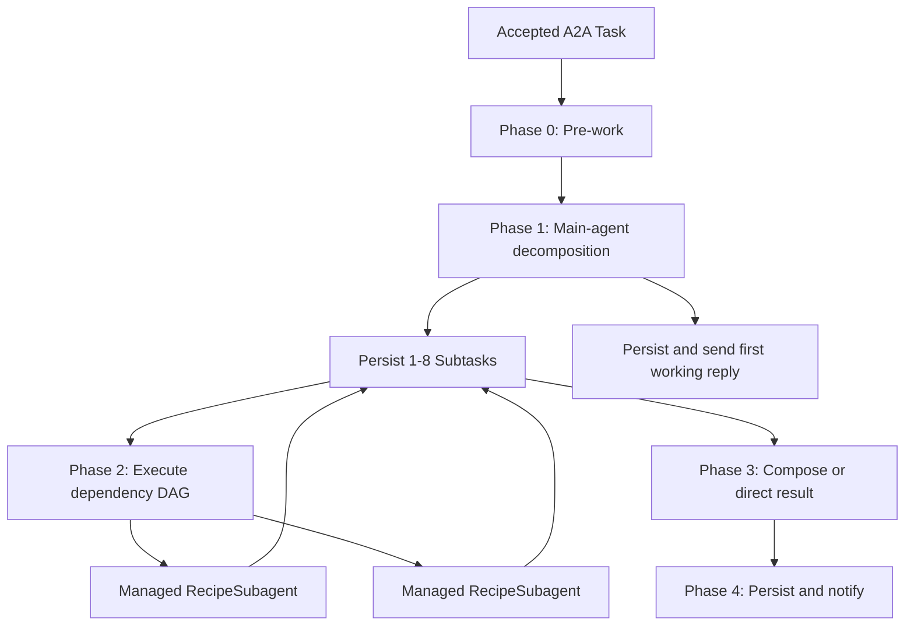

# Phased Task Recipes and Subagents

## Goal

Refactor `HandleTaskWorkflow` into five explicit runtime phases:

0. Pre-work
1. Decompose Task
2. Execute Subtasks
3. Compose Task
4. Deliver Task

The caller-owned `ReactiveAgent` remains the durable main agent and owner of the continuous Session. Every incoming Task is decomposed into one to eight durable Subtasks. Dependency-ready Subtasks run concurrently through caller-local, database-backed Recipe configuration and isolated Agents SDK subagents. The main agent composes multiple outcomes, while a single successful Subtask bypasses composition. Phase 4 retains the signed asynchronous A2A delivery contract.

## Core Invariants

- Every accepted parent Task has between one and eight Subtasks after Phase 1.
- Subtasks are durable rows in the caller's `ReactiveAgent` SQLite database. Workflow state is not their source of truth.
- A Subtask has three distinct input categories:
  - `prompt`: a non-session instruction generated by the main agent.
  - `referencePartIds`: exact source-part identifiers selected from the main agent's live Session catalog.
  - `dependencyResults`: generated output from prerequisite Subtasks.
- Every original conversation part receives one unique, monotonically increasing `partId` within its caller's main-agent SQLite database when it enters the durable Session. The ID is never reused, but its source part may later be removed by Session compaction.
- The decomposition model selects `partId` values only. Application code resolves each ID to its live exact source part; the model never rewrites, summarizes, fabricates, or relabels reference content.
- Filtered IDs remain visible. A Subtask may select parts 5, 6, 10, 11, 12, 20, 22, 26, and 27; IDs are not renumbered, even when a source part has been compacted away.
- Compaction summaries, recall results, system/context blocks, and tool output are not eligible reference parts. Information about them can only be in the `prompt` input per main agent discretion.
- Recipes are caller-local database configuration. Each Recipe stores an enabled state, version, primary/fallback model ID strings, soul text, and a JSON array of tool families.
- Decomposition assigns only a semantic Subtask `type`; it never names a Recipe. When a pending Subtask starts, its type resolves through `subtask_type_recipes` to one enabled Recipe, or to the migration-seeded `default` Recipe when no active association exists.
- The resolved Recipe ID and version are recorded on the Subtask after-the-fact, at execution start. Model IDs and tool families remain code-validated: invalid model IDs fall back independently to existing defaults, unknown or removed tool families are ignored, and `recall` and Session `set_context` are never Recipe-selectable.
- Subagents have no Session, durable memory, recall access, or access to parent history beyond the supplied references.
- Managed subagents are deleted with `deleteSubAgent()` after their terminal result is durably copied into the parent.
- Dependency edges form a validated DAG through `dependsOn: SubtaskId[]`.
- All ready Subtasks run concurrently. The maximum of eight Subtasks bounds fan-out.
- Failure of one branch skips its dependent descendants but does not stop independent branches.
- Parent cancellation stops new work and propagates into pending Subtask states. Already-running model calls are best effort, and late results are discarded.

## Target Flow



## Phase A: Contracts, References, and Persistence

### A1. Define RPC-safe Subtask contracts

Add `src/agent/subtasks/types.ts` with plain, serializable contracts suitable for native Durable Object RPC.

Define:

- `SubtaskStatus`:
  - `pending`
  - `running`
  - `completed`
  - `failed`
  - `skipped`
  - `canceled`
- `SubtaskId`: a caller-local, SQLite-assigned, monotonically increasing numeric identifier.
- `ConversationPart`: a metadata-free union corresponding to A2A text, file, and data parts.
- `SessionPartId`: the caller-local, unique, monotonically increasing numeric identifier for an original Session part.
- `ResolvedReferencePart`: the exact metadata-free source part, original role, and available author/channel provenance returned by a live lookup of one `SessionPartId`; lookup returns `null` after source retention or compaction removes the part.
- `Subtask`:
  - Numeric `id: SubtaskId`
  - Parent `taskId`
  - `ordinal`
  - Semantic `type`
  - Nullable resolved Recipe ID and version, written only when execution starts
  - Non-session `prompt`
  - Immutable `referencePartIds`
  - `dependsOn: SubtaskId[]`
  - `status`
  - `resultParts`
  - Optional diagnostic `error`
  - `createdAt`
  - `updatedAt`
  - Nullable `completedAt`
- Decomposition drafts and output.
- Dependency-result records.
- Recipe execution request and result.
- Composition input and output.

Successful Recipe output must include at least one non-empty text result part. Additional file and data parts are allowed.

### A2. Preserve structured inbound parts

Extend `src/a2a/inbound.ts` so ingress does not discard file and data parts.

- Sanitize text, file, and data parts.
- Strip untyped metadata before parts cross RPC boundaries.
- Validate that data parts contain JSON-safe values.
- Enforce explicit per-part, part-count, and aggregate payload limits.
- Retain `textOf()` for the main Session representation.
- Persist sanitized original inbound parts once in the main Session's canonical source-part storage, assigning their caller-local `partId` values; Subtasks retain only those IDs.
- Add the sanitized parts to `HandleTaskParams` in `src/a2a/executor.ts`.
- Reject requests with no usable parts before starting the Workflow.

### A3. Build the live Session part-ID catalog

Assign a unique, monotonically increasing `partId` in the caller's main-agent SQLite database when each original user or assistant part enters the durable Session. Store the identifier with its source part rather than in a copied reference-payload table.

Build a deterministic live catalog during Phase 1 from:

- Verbatim live user and assistant Session messages.
- Structured parts from the current inbound Task.

The catalog must:

- Expose the existing caller-local `partId` for every live source part.
- Preserve exact text, file, and data payloads, role, and available author/channel provenance at the source.
- Avoid writing a second copy of source payloads or provenance into Subtask persistence.
- Exclude Session compaction summaries, recall-search results, system prompts, context blocks, and tool output.

The main agent may use summaries and recall while reasoning, but it may delegate only live original source-part IDs. A source part removed by compaction is no longer resolvable; that is an expected best-effort omission, not a Subtask failure.

### A4. Add durable Subtask storage

Extend `src/db/schema.ts` with caller-local `recipes`, `subtask_type_recipes`, and `subtasks` tables. The `recipes` table has a unique key, enabled state, version, primary/fallback model IDs, soul, and `tool_families_json`. The association table has one unique semantic Subtask type per Recipe mapping. The `subtasks` table uses an SQLite integer primary key to assign a unique, monotonically increasing `SubtaskId` within the caller's main-agent database, and is indexed by parent Task/order and status.

Seed one enabled `default` Recipe through the migration with the existing primary/fallback model IDs, a stateless execution soul, and the `browser` tool family. The seed is applied independently in each caller's private DO database.

Persist:

- Parent Task ID and ordinal.
- Semantic type and nullable resolved Recipe ID/version.
- Non-session prompt.
- Reference part-ID JSON only; do not copy source payloads or provenance.
- Dependencies JSON.
- Status and result parts JSON.
- Error and timestamps.

Add `src/db/models/subtasks.ts` with:

- Atomic, idempotent creation of the full decomposition.
- `get` and ordered `list` methods.
- Guarded status transitions.
- Completion/failure result persistence.
- Skip and cancellation transitions.
- Parent cleanup support.

Add Recipe and type-mapping query models with:

- Lookup of the latest enabled Recipe for a Subtask's semantic type, falling back to `default`.
- Execution-time resolution that records Recipe ID/version atomically with the pending-to-running transition.
- Recipe version increments for future configuration modifications; association changes do not alter Recipe versions.

Wire these as `db.recipes`, `db.subtaskTypeRecipes`, and `db.subtasks` in `src/db/db.ts`. Extend the existing 30-day cleanup so expired parent Task rows and their Subtasks are removed together.

Generate the Drizzle migration with `npx drizzle-kit generate`, preserve generated SQL and metadata, and mirror the SQL and journal entry into `src/db/migrations/index.ts`.

### Phase A Exit Criteria

- Structured inbound parts survive executor-to-Workflow RPC unchanged after sanitization.
- Source parts can be selected by caller-local `partId` without duplicating payloads in Subtask rows.
- A compacted-away source ID resolves to `null` and is omitted from the Subtask invocation without failing the Subtask.
- Subtask creation is idempotent and constrained to one through eight nodes.
- Invalid states and invalid JSON payloads are rejected before persistence.
- Focused ingress and database tests pass.

## Phase B: Database-backed Recipe Configuration and Managed Subagents

### B1. Resolve Recipe configuration safely

Keep Recipes as data in the caller's database; do not add a `src/recipes/` registry. Adapt the existing model and tool seams so a resolved Recipe configures an isolated subagent invocation.

A Recipe row contains:

- Unique key, enabled state, and version.
- Primary and fallback Workers AI model ID strings.
- Dedicated stateless soul text.
- A JSON array of allowed tool-family keys.

Parameterize `createModelPair` so it accepts the stored IDs. Code owns the supported model allowlist and independently substitutes the existing primary or fallback default when one stored ID is unsupported or unavailable. Recipe data never provides arbitrary bindings, tools, or secrets.

Add a code-owned tool-family resolver:

- `browser` is initially recognized and enabled by the seeded `default` Recipe.
- Unknown or removed families are ignored.
- `recall` and Session `set_context` are never valid Recipe families.

The parent resolves semantic type to an enabled Recipe only at execution start. The child receives the resolved, RPC-safe Recipe configuration and validates it defensively with the same code-owned model and tool rules.

### B2. Add `RecipeSubagent`

Create `src/subagent/index.ts` with `RecipeSubagent extends Agent<Env>` and export it from `src/index.ts`.

Its domain RPC `execute(request)` must:

1. Validate the already-resolved Recipe configuration.
2. Build a fresh invocation with clearly separated sections:

- Resolved Recipe soul.
- Main-agent instruction prompt.
  - Live original conversation references with `[part N]` labels, role, and provenance.
- Generated dependency results, explicitly labeled as generated.

3. Run the Recipe's bounded model/tool loop.
4. Return terminal completed or failed output.

Resolve `referencePartIds` when building the Subagent invocation. Render each returned source part exactly once; silently omit an ID whose source lookup returns `null` after compaction. Reference rendering must not summarize, rewrite, interpolate, or present dependency output as user-authored evidence.

The Subagent must never:

- Construct a Session.
- Read parent history beyond supplied references.
- Use recall or durable memory.
- Resolve a Recipe by semantic type or read the parent's Recipe catalog.
- Accept arbitrary model, binding, or tool configuration beyond the parent's resolved Recipe data.

### B3. Make Subagent execution retry-safe

Persist only one temporary terminal result in the managed child, keyed by a deterministic request fingerprint.

- A retry with the same fingerprint returns the cached result.
- A different request for the same child name is rejected.
- Primary-model failure falls back to the resolved, code-validated fallback model.
- A valid exhausted Recipe error becomes a terminal failed result.
- Genuine RPC/platform faults throw so the enclosing Workflow step can retry.

Do not add `RecipeSubagent` to production `durable_objects.bindings` or `new_sqlite_classes`; Agents SDK facets are created beneath the bound `ReactiveAgent`. Add a test-only binding only if the Workers Vitest runtime requires it for `ctx.exports`.

### Phase B Exit Criteria

- Recipe capabilities are determined by validated caller-local configuration and code-owned model/tool allowlists.
- The seeded `default` Recipe runs without Session or parent-memory access.
- Reference, prompt, and dependency sections remain distinguishable in tests.
- Repeating the same execution does not repeat inference after a cached terminal result.
- The Subagent can be created and deleted through the Agents SDK lifecycle.

## Phase C: Main-Agent Decomposition and Composition

### C1. Add structured decomposition

Split the current generic turn behavior into explicit main-agent operations while reusing model fallback, Session helpers, history conversion, and tool construction.

Add a decomposition operation using `generateText` with `Output.object()`.

The operation must:

1. Append the inbound user text to the continuous Session exactly once.
2. Read the current system prompt, history, and live `partId` reference catalog.
3. Allow the main agent's existing gated tools while reasoning.
4. Return:
   - A non-empty first user-visible `reply`.
   - One through eight Subtask drafts.

Each draft contains:

- Unique local key.
- Semantic Subtask `type`.
- Non-session instruction `prompt`.
- Ascending unique `referencePartIds: number[]`.
- Dependency references to local keys.

The decomposition model never emits source Part payloads.

Application code must:

- Validate every selected `partId` against the live catalog.
- Persist only the validated `SessionPartId` values; do not copy `ResolvedReferencePart` payloads or provenance into the Subtask.
- Preserve visible `partId` gaps.
- Resolve draft-local keys to SQLite-assigned numeric `SubtaskId` values before persisting dependency edges.
- Preserve draft array order as `ordinal`.
- Reject unknown, duplicate, self-referential, missing, or cyclic dependency edges.
- Persist the complete valid decomposition atomically before returning.

If both primary and fallback decomposition fail or return invalid output, the parent Task fails. Do not silently synthesize a general Subtask.

### C2. Persist and deliver the Phase 1 reply

Append the decomposition reply to the main Session and emit it as a deterministic `working` callback before Phase 2.

Refactor progress callback IDs in `src/a2a/notify.ts` to accept stable semantic keys, such as `taskId:decompose`, without colliding with tool-step progress IDs.

### C3. Add parent-owned Subtask execution RPCs

Add narrow RPC methods to `ReactiveAgent`:

- `decomposeTask(...)`
- `executeSubtask(id)`
- `listSubtasks(taskId)`
- `skipBlockedSubtasks(taskId)`
- `cancelPendingSubtasks(taskId)`
- `composeTask(...)`

`executeSubtask(id)` must:

1. Return immediately when the parent already has a terminal Subtask result.
2. Load successful dependency results separately from original references.
3. Resolve the latest enabled Recipe mapping for the Subtask's semantic type, falling back to `default`, and atomically record its ID/version while marking the Subtask running.
4. Reset stale managed-child state when beginning a genuinely new execution.
5. Create/get the child through `subAgent(RecipeSubagent, name)`.
6. Invoke the child.
7. Re-check parent cancellation.
8. Persist the terminal child outcome in the parent.
9. Delete the managed child with `deleteSubAgent(RecipeSubagent, name)` only after the durable parent copy succeeds.

On an ambiguous retry, recover from either the terminal parent row or the child's temporary cached result. Never delete the child before its result is durably copied.

### C4. Add composition

For exactly one successful Subtask:

- Skip main-agent composition inference.
- Use its `resultParts` directly.
- Append its required text summary to the continuous Session.

For multiple Subtasks:

- Load outcomes in stable ordinal order.
- Include completed, failed, and skipped branches.
- Generate a final main-agent reply that uses available successes and discloses relevant failures.
- Append the final reply to the Session without appending the original user turn again.

If no Subtask succeeds, produce a terminal parent failure instead of invoking composition.

### Phase C Exit Criteria

- Phase 1 emits and persists a valid one-to-eight-node DAG.
- The model selects live source references by `partId` only; source parts remain byte-for-byte preserved while retained, and compacted-away IDs are omitted at invocation time.
- The first reply is both visible and durable in Session history.
- Single-Subtask completion incurs no composition inference.
- Multi-Subtask partial success composes a useful final response.

## Phase D: Workflow DAG and Terminal Delivery

### D1. Refactor `HandleTaskWorkflow`

Implement the existing phase markers in `src/workflows/handle-task.ts`.

#### Phase 0: Pre-work

- Resolve the caller's parent `ReactiveAgent`.
- Mark the parent Task working.
- Stop early if already canceled.

#### Phase 1: Decompose Task

- Run one durable `decompose` step.
- Call `decomposeTask` on the parent.
- Persist one through eight Subtasks.
- Persist and send the first working reply.
- Route typed decomposition failure to failed terminal delivery.

#### Phase 2: Execute Subtasks

Add a pure scheduler in `src/subtasks/scheduler.ts`.

For each DAG wave:

1. Reload persisted Subtask states.
2. Mark nodes blocked by failed/skipped dependencies as skipped.
3. Identify all pending nodes whose dependencies completed successfully.
4. Check parent cancellation.
5. Run all ready nodes concurrently with `Promise.all`.
6. Give each Subtask a stable durable Workflow step name such as `execute:<stable-id>`.
7. Reload persisted state before selecting the next wave.

There is no scheduler concurrency cap beyond the hard maximum of eight total Subtasks.

Reject or fail safely on:

- Missing dependency IDs.
- Self-dependencies.
- Cycles.
- A scheduler state with pending nodes but no ready or newly skippable nodes.

#### Phase 3: Compose Task

- Directly return one successful Subtask's parts.
- Otherwise call main-agent composition when at least one branch succeeded.
- Fail the parent when no branch succeeded.
- Re-check cancellation before composing.

#### Phase 4: Deliver Task

Retain the existing persist-then-sign-then-notify sequence.

- Build and persist a completed Task for success.
- Build and persist a failed Task for decomposition failure or zero successful Subtasks.
- Re-check cancellation before terminal persistence and notification.
- Use deterministic terminal message IDs.
- Keep notification retry behavior safe through the gateway's token deduplication.

### D2. Extend A2A task builders

Update `src/a2a/notify.ts`:

- Allow completed Task messages to carry sanitized `Part[]`.
- Preserve the required text summary for gateway rendering and main Session continuity.
- Add a deterministic failed-Task builder using A2A `state: "failed"`.
- Use user-safe failure text in callbacks.
- Keep internal diagnostics in Subtask persistence and logs, not user-visible Task messages.

### D3. Propagate cancellation

Check parent cancellation:

- Before decomposition.
- Before each DAG wave.
- Before composition.
- Before terminal persistence and delivery.

On cancellation:

- Stop scheduling new work.
- Mark pending Subtasks canceled.
- Delete managed child state where applicable.
- Discard late results from already-running model calls.
- Do not send completed or failed terminal output after cancellation.

### Phase D Exit Criteria

- The Workflow survives replay without duplicating decomposition, inference, persistence, or delivery effects.
- Dependency-ready branches run concurrently and in dependency order.
- Failed branches skip descendants while independent branches finish.
- Canceled Tasks stop accruing new work.
- Completed and failed terminal callbacks are signed and deterministic.

## Phase E: Verification and Documentation

### E1. Focused tests

Add or extend:

- `test/a2a/inbound.spec.ts`
  - Text, file, and data preservation.
  - Metadata stripping.
  - JSON and payload-bound rejection.
- `test/db/subtasks.spec.ts`
  - Migration and schema.
  - Idempotent decomposition creation.
  - Ordering and transitions.
  - Result/error persistence.
  - Cancellation and cleanup.
- `test/subtasks/scheduler.spec.ts`
  - Independent fan-out.
  - Multiple dependencies and fan-in.
  - Wave ordering.
  - Missing/self/cyclic dependency rejection.
  - Failed-node skip propagation.
  - Cancellation.
- `test/db/recipes.spec.ts`
  - Per-caller migration seed and unique `default` Recipe.
  - Semantic-type mapping and default fallback.
  - Execution-time Recipe ID/version recording.
  - Model allowlist and independent fallback behavior.
  - Tool-family resolution, including ignored unknown families and excluded recall/context tools.
- `test/subagent/subagent.spec.ts`
  - Fresh stateless prompts.
  - Exact live-reference rendering with visible `partId` gaps.
  - Compacted-away source IDs are omitted without failing execution.
  - Role and provenance preservation.
  - Separate dependency results.
  - No source mutation.
  - Primary/fallback behavior.
  - Required text summary.
  - Terminal cache reuse and fingerprint mismatch rejection.
  - Managed-child deletion and storage cleanup.
- `test/agent/`
  - Structured decomposition.
  - `partId`-only reference selection.
  - Ascending/unique/unknown `partId` validation.
  - Exact live source-part preservation and compaction omission.
  - Session append semantics.
  - Invalid DAG and decomposition failures.
  - Single-result bypass.
  - Multi-result composition.
- `test/workflows/handle-task.spec.ts`
  - All five phases.
  - First working callback.
  - Single-node bypass.
  - Parallel waves and dependencies.
  - Partial and total failure.
  - Cancellation between waves.
  - Deterministic terminal notification.
- `test/index.spec.ts`
  - Structured parts crossing executor to Workflow.
  - Unchanged immediate submitted Task contract.

Where facet support permits, add a real integration assertion that `ReactiveAgent.listSubAgents(RecipeSubagent)` is empty after success, failure, cancellation, and replay. If Workers Vitest requires a test-only binding for `ctx.exports`, configure it without adding a production migration.

### E2. Documentation

Update:

- `ARCHITECTURE.md`
- `AGENTS.md`
- `README.md`

Document:

- Five Workflow phases.
- Parent/managed-child ownership.
- Subtask contract and status lifecycle.
- Caller-local Session `partId` allocation, lazy reference resolution, compaction omission, and visible ID gaps.
- Caller-local Recipe configuration, semantic-type mapping, execution-time resolution, and code-owned validation boundary.
- DAG scheduling semantics.
- Child retry cache and deletion lifecycle.
- Failure and cancellation behavior.
- Database migration and testing strategy.

Re-read `ARCHITECTURE.md` immediately before editing so concurrent user changes are preserved.

### E3. Final validation

Run:

```sh
npx drizzle-kit generate
npm run types
npm run check
npm run test
git diff --check
```

Also scan the repository for stale one-step Workflow documentation and verify that the test suite remains hermetic: no real AI, Browser Rendering, or network calls.

## Implementation Order

Land the work in this order so each phase leaves a coherent, testable repository:

1. Contracts, sanitizer, reference catalog, schema, and database model.
2. Caller-local Recipe configuration, model/tool validation, and stateless managed Subagent.
3. Main-agent decomposition and exact reference resolution.
4. Parent-owned execution lifecycle and DAG scheduler.
5. Composition and A2A completed/failed builders.
6. Five-phase Workflow integration and cancellation.
7. Full integration tests and documentation.

## Explicitly Out of Scope

- Recipe administration APIs or UI.
- Runtime mutation endpoints for creating, deleting, or fine-tuning Recipes or their semantic-type associations.
- Authorization policy for future domain-specific tools.
- Cross-parent or shared Subagents.
- Human approval Workflow events.
- More than eight Subtasks per parent Task.
- Presenting summaries, recall results, or generated dependency output as original conversation evidence.
